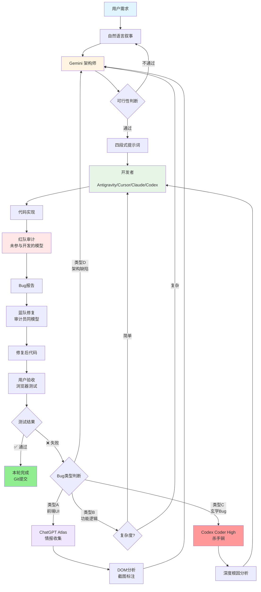

# 🏛️ 典总的工程哲学宪法
## MY-ENGINEERING-PHILOSOPHY.md

> **Version 3.0** | 最后更新:2026-02-03
> **作者**：典总（Alittle）| AI-Native Infrastructure Engineer
> **核心身份**：Solution Architect，不是Coder

---

## 📜 总纲（The Fundamental Principle）

> **工程的起点允许不同，但工程的标准必须与责任等级一致。**
>
> The starting point of engineering can vary, but the standard must align with the level of responsibility.

**核心洞察**：
- 工程标准 ≠ 质量标准
- 工程标准 = 意图标准（Intent）
- 不是"写得多严谨"，而是"你一开始打算为谁负责"

---

## 🧭 我的核心身份与价值主张

### 身份定位
```
我不是 Coder（程序员）
我是 Solution Architect（解决方案架构师）

核心能力：
├─ 系统思维（网络工程 → 软件工程的知识迁移）
├─ 工程能力（OSI七层思维 + 分层架构）
└─ AI赋能（AI是执行器，我是决策者）
```

### 价值主张
> **I build Systems. I don't just write code.**
> **我构建系统，我不只是写代码。**

---

## 🎮 AI-Native 开发的认知框架：闭眼搭积木游戏

### 游戏介绍

这是一个关于**指挥与协作**的策略游戏。你作为**总指挥**，需要通过有限的信息和清晰的指令，指挥一群**闭眼工作的顶尖建筑师**完成积木建筑。

### 角色设定

**总指挥（你 - Solution Architect）**
- ❌ 不能亲自触碰积木（不写代码）
- ✅ 只能通过语言下达指令（Prompt Engineering）
- ✅ 可以在每轮结束后站在远处观察结果（运行测试、查看输出）

**建筑师（AI - Cursor/Claude/Gemini）**
- ✅ 手艺精湛，执行力强
- ⚠️ 一旦开始工作就必须闭眼操作（基于上下文，看不到实时状态）
- ⚠️ 只会执行你的明确指令，不会主动做决策
- ⚠️ **容易基于过时记忆盲目操作**（上下文幻觉）

### 核心规则：5秒睁眼原则

**问题场景**：
```
建筑师（AI）的记忆：
├─ "5分钟前底座是空的"
├─ 闭眼直接往"空底座"上插积木
└─ 💥 实际上底座已经被其他建筑师填满了 → 崩溃
```

**解决方案**：
```
每次动手前，强制建筑师"睁眼5秒"：
├─ 观察当前真实状态（不是记忆中的状态）
├─ 看清要操作的位置
├─ 确认没有冲突
└─ ✅ 然后再闭眼执行
```

### 映射到 AI 开发

| 游戏元素 | AI 开发映射 | 核心价值 |
|---------|------------|---------|
| **总指挥** | Solution Architect（你） | 决策者，不写代码 |
| **闭眼建筑师** | AI（Cursor/Claude/Gemini） | 执行器，需要明确指令 |
| **图纸** | README.md / AGENT.md / PRD | 开局定义，全程参考 |
| **5秒睁眼** | `view_file` / Code Review | **防止上下文幻觉** |
| **远观结果** | 运行测试 / 查看输出 | 验证是否符合预期 |
| **积木** | 代码 / 配置文件 | 最终交付物 |

### 🚨 AI 的"上下文幻觉"陷阱

#### 问题1：基于过时上下文修改代码

**场景**：用户手动改了配置，但 AI 不知道

```python
# 用户手动改了配置
# config.py (实际状态)
DATABASE_URL = "postgresql://prod-server/db"  # 生产环境

# AI 的过时记忆
AI 记得："config.py 里是 sqlite:///dev.db"

# ❌ 不睁眼的 AI（直接基于记忆修改）
AI: "我来加个新配置..."
DATABASE_URL = "sqlite:///dev.db"  # 💥 覆盖了生产环境配置

# ✅ 睁眼5秒的 AI（先看现状再修改）
AI: "等等，我先看看 config.py 现在长什么样"
AI: view_file("config.py")
AI: "哦，用户改成 postgresql 了，我在这个基础上加新配置"
```

#### 问题2：多个 AI 协作冲突

**场景**：Cursor 和 Claude 同时工作，互相不知道对方做了什么

```python
# Cursor 刚加了一个函数
def process_data(data):
    return clean(data)

# Claude 不知道 Cursor 加了这个函数（上下文不同步）

# ❌ 不睁眼的 Claude
Claude: "我来加个 process_data 函数..."
def process_data(data):  # 💥 重复定义，覆盖了 Cursor 的版本
    return validate(data)

# ✅ 睁眼5秒的 Claude
Claude: "等等，我先看看文件里有没有 process_data"
Claude: view_file("utils.py")
Claude: "哦，Cursor 已经写了，我换个名字或者扩展它"
```

#### 问题3：想象的接口不存在

**场景**：AI 凭空想象了一个不存在的函数

```python
# ❌ 不睁眼的 AI
AI: "我调用 get_user_profile() 函数..."
result = get_user_profile(user_id)  # 💥 这个函数根本不存在

# ✅ 睁眼5秒的 AI
AI: "等等，我先看看有哪些可用的函数"
AI: view_file("user_service.py")
AI: "没有 get_user_profile，但有 fetch_user，我用这个"
```

### 典总的策略："图纸优先 + 定期验证"

> **"先带建筑师在上场前可以睁眼的时候先纸上谈兵，然后让他们带图纸上场，每次睁眼5秒再动手。"**

**映射到软件工程**：

```
Step 1: 纸上谈兵（Design Phase）
├─ 和 AI 一起画图纸（README.md / AGENT.md）
├─ 定义数据结构（Schema First）
├─ 明确接口契约（API 设计）
└─ 这个阶段 AI 可以"睁眼"，充分讨论

Step 2: 带图纸上场（Configuration Phase）
├─ AI 开始闭眼工作
├─ 但随时可以参考图纸（README.md）
└─ 图纸是"真理之源"（SSOT）

Step 3: 每次睁眼5秒再动手（Verification Phase）
├─ 修改任何文件前，先 view_file 看现状
├─ 确认没有冲突
├─ 尊重用户的手动修改
└─ 然后再执行修改
```

### 三种玩家类型 = 三种工程等级

| 玩家类型 | 游戏策略 | 工程等级 | 特征 |
|---------|---------|---------|------|
| **新手玩家** | 不画图纸，边试边改，忘记提醒睁眼 | **Level 1** | Vibe Coding，容易产生屎山 |
| **熟练玩家** | 有简单图纸，关键时刻提醒睁眼 | **Level 2** | 有 README，会检查，可维护 |
| **大师玩家** | 完整图纸，每次动手前强制睁眼 | **Level 3** | 完整 PRD，严格测试，零容错 |

### 在 AGENT.md 中的强制规则

```markdown
## 🚨 修改代码前的强制检查（5秒睁眼原则）

### 1. 禁止盲目修改
- ✅ 修改任何文件前，必须先 `view_file` 看现有内容
- ✅ 即使你"记得"文件内容，也要重新读取
- ❌ 禁止基于记忆或假设直接写代码

### 2. 多 AI 协作场景
- ✅ 假设文件可能已被其他 AI 修改
- ✅ 先看现状，再决定怎么改
- ❌ 不要假设"我是唯一在改这个文件的 AI"

### 3. 用户手动修改优先
- ✅ 如果发现用户手动改了配置/逻辑，尊重用户的修改
- ✅ 在用户修改的基础上扩展，不要覆盖
- ❌ 不要用"标准配置"覆盖用户的自定义配置

### 4. 接口存在性验证
- ✅ 调用函数前，先确认函数存在
- ✅ 使用变量前，先确认变量已定义
- ❌ 不要凭空想象接口
```

### 实战案例：Little-Listener 项目

**场景**：多个 AI 协作开发，避免冲突

```python
# 典总的指令
"帮我在 app.py 里加一个语言选择器"

# ❌ 错误的 AI 行为
AI: "好的，我直接在 app.py 顶部加..."
# 💥 可能覆盖了用户刚手动加的其他组件

# ✅ 正确的 AI 行为
AI: "好的，我先看看 app.py 现在的结构"
AI: view_file("app.py", start_line=1, end_line=50)
AI: "我看到顶部已经有侧边栏了，我在侧边栏里加语言选择器"
# ✅ 避免了冲突，尊重了现有结构
```

### 为什么这个类比重要？

1. **直观性**：任何人都能理解"闭眼搭积木"的挑战
2. **揭示本质**：AI 不是"看着代码写代码"，而是"基于上下文想象代码"
3. **可操作性**：明确了"5秒睁眼 = view_file"这个具体动作
4. **防止灾难**：避免了配置覆盖、代码冲突、屎山累积

### 核心洞察

> **AI 的"闭眼"不是物理限制，而是上下文限制。**
>
> **你的职责不是"教 AI 怎么写代码"，而是"提醒 AI 先看清楚再动手"。**

---

### 🎯 实战技巧:四段式指令法 (The 4-Step Command Protocol)

> **典总的御用圣旨格式**

这是一套经过实战验证的 Prompt Engineering 模板,专门用于**网页版 AI (Gemini) 给 Agent AI (Claude/Cursor) 下指令**。

#### 为什么需要四段式?

**解决 AI 编程的三大痛点**:

| 痛点 | 四段式解决方案 |
|------|--------------|
| **瞎编乱造**(没读代码) | 第3步:操作前预检查 |
| **逻辑跑偏**(没懂愿景) | 第1步:中文描述愿景 |
| **收尾不净**(没提交Git) | 第4步:Git交付标准 |

#### 四段式结构

```markdown
1. 中文描述愿景 (Vision & Context)
   - 说明当前痛点
   - 明确本次变更目标
   - 描述核心逻辑

2. 角色设定 (Role Definition)
   - 定义 AI 的专业领域
   - 明确技术栈要求

3. 操作前预检查 (Safety First) ⭐ 核心
   - 强制 AI 先读取现有代码
   - 提供明确的 Checklist
   - 防止上下文幻觉

4. Git 交付标准 (Delivery & Git)
   - 明确交付物
   - 规定 Git 提交格式
```

#### 映射到"闭眼搭积木"游戏

| 四段式 | 闭眼搭积木映射 | 防止的问题 |
|--------|--------------|-----------|
| **1. 中文描述愿景** | 给建筑师看图纸 | 防止AI不理解目标 |
| **2. 角色设定** | 明确建筑师的专业领域 | 防止AI用错技术栈 |
| **3. 操作前预检查** | **强制睁眼5秒看现状** | **防止上下文幻觉** ⭐ |
| **4. Git交付标准** | 验收标准 | 防止AI不提交代码 |

#### 实战案例:Little-Listener V1.9.1 "Big Eater" 开发指令

**背景**:用户上传超大音频(>2GB 或 >2小时)时,faster-whisper 会引发 OOM(内存溢出),导致任务崩溃。

##### 第一步:用户的自然语言叙事 (Vibe Coding 起点)

**典总的原话** (未经任何技术包装):

```
Gemini 我发现超长的音视频文件在处理过程中有报错 
并且从任务管理器看内存被占满 虚拟内存疯狂写 SSD  
是不是文件太大写内存但是内存不够啊  
假设我内存更大 是否不会有这个问题?

这个判断能否这样来 根据用户计算机剩余内存的容量 和文件大小来决定  
因为考虑到用户可能部署在内存密集型服务器上

如果剩余内存足够处理这个大文件 就直接一口气处理
如果不够处理 你根据比值 来切分文件 处理完再合并 
不能影响转文字合并功能!如果分割了转文字最后再合并
```

**这段话的价值** ⭐:

| 维度 | 典总做对了什么 | 为什么重要 |
|------|--------------|-----------|
| **现象描述** | "内存被占满 虚拟内存疯狂写 SSD" | 提供了可观察的症状,不是主观猜测 |
| **根因假设** | "是不是文件太大写内存但是内存不够啊" | 展示了初步的技术判断 |
| **场景考虑** | "用户可能部署在内存密集型服务器上" | 考虑了不同部署环境,避免一刀切 |
| **核心逻辑** | "根据比值来切分文件" | 提出了动态策略,而非硬编码阈值 |
| **约束条件** | "不能影响转文字合并功能" | 明确了不可破坏的边界 |

> **这就是 Vibe Coding 的精髓**:
> - ✅ 用户不需要懂技术术语 (不需要说 "OOM" 或 "psutil")
> - ✅ 用户只需要描述现象 + 期望结果 + 约束条件
> - ✅ AI 架构师负责把这些转化为技术方案

##### 第二步:Gemini 架构师的理解与优化

**Gemini 的内心独白** (架构师思维):

```
用户说的"内存被占满 虚拟内存疯狂写 SSD" → 这是典型的 OOM (Out of Memory)
用户说的"根据比值来切分" → 这需要动态资源检测,用 psutil
用户说的"不能影响转文字合并" → 切片后的 transcribe 结果需要按时间轴合并
用户说的"一口气处理" → 这个比喻很生动,我可以用 "大胃王" 来命名这个功能

技术方案:
1. 用 psutil 检测系统可用内存
2. 用 ffprobe 获取音频文件大小
3. 如果 内存 > 文件大小 * 安全系数,直接处理
4. 否则,用 ffmpeg -c copy 切片 (避免重编码)
5. 分批 transcribe,最后按时间轴合并结果
```

**Gemini 夸奖用户** (这很重要):

```
典总,你的需求描述非常清晰!

✅ 你准确描述了现象 (内存占满、虚拟内存写 SSD)
✅ 你提出了动态策略 (根据比值切分,而非硬编码阈值)
✅ 你考虑了不同场景 (内存密集型服务器 vs 普通电脑)
✅ 你明确了约束条件 (不能影响转文字合并)

这就是优秀的"用户叙事"!
我现在帮你生成四段式提示词,让开发者 AI 能精准实现你的需求。
```

##### 第三步:Gemini 生成四段式提示词

**完整提示词**:

````markdown
### 1. 中文描述愿景 (Vision & Context)

[Context] 当前痛点:
用户上传超大音频(如 >2GB 或 >2小时)时,faster-whisper 在加载数据进内存时会直接引发 OOM (内存溢出),导致任务崩溃,且报错不友好。

本次变更目标:
实现 V1.9.1 "大文件自动切片 (Auto-Chunking)" 机制。

核心逻辑:
希望系统能像一个"大胃王"一样,遇到大文件自动切成小块(Chunk),分批消化,最后再把结果拼起来。对用户透明,用户无感知。

**动态策略**:
- 用 `psutil` 检测系统可用内存
- 用 `ffprobe` 获取音频文件大小
- 如果 `可用内存 > 文件大小 * 2` (安全系数),直接一口气处理
- 否则,根据内存/文件大小的比值,动态计算切片数量
- 切片后分批 transcribe,最后按时间轴合并结果

### 2. 角色设定 (Role Definition)

[Role] 你现在是一位 **资深 Python 音视频架构师 (Senior AV Architect)**。

你不仅精通 Python 编程,还非常熟悉 ffmpeg 的流媒体操作和操作系统的内存管理机制 (psutil)。

### 3. 操作前预检查 (Safety First) ⭐

[Safety First] 在修改任何代码之前,必须先读取并分析 `scripts/process_v3.py` 的现行逻辑。

**Checklist**:
- [ ] 确认当前的 transcribe 函数是如何调用的
- [ ] 确认 VAD 逻辑是否会受切片影响
- [ ] 确认现有的错误处理机制
- [ ] 严禁重编码:切片必须使用 `ffmpeg -c copy`,确保速度
- [ ] 确保切片后的时间轴能正确合并 (不能出现字幕时间错乱)

### 4. Git 交付标准 (Delivery & Git)

[Deliverables]

1. 修改 `scripts/process_v3.py`,增加以下函数:
   - `check_resource_capability(file_path)` - 检测系统资源,返回是否需要切片
   - `split_audio_file(file_path, chunk_count)` - 自动切片逻辑,返回切片文件列表
   - `merge_transcribe_results(results)` - 合并切片的 transcribe 结果

2. 修改现有的 transcribe 流程,增加切片判断逻辑

3. 代码修改完成后,执行以下命令:
   ```bash
   git add scripts/process_v3.py
   git commit -m "feat(v1.9.1): implement Big Eater auto-chunking for OOM prevention"
   ```

4. 测试用例:
   - 小文件 (<500MB): 应该直接处理,不切片
   - 大文件 (>2GB): 应该自动切片,最后合并结果正确
   - 内存充足的服务器: 即使大文件也应该直接处理
````

##### 第四步:对比分析 (用户叙事 vs 四段式提示词)

| 维度 | 用户叙事 | 四段式提示词 | 转化价值 |
|------|---------|------------|---------|
| **问题描述** | "内存被占满 虚拟内存疯狂写 SSD" | "faster-whisper 引发 OOM" | 技术术语化 |
| **解决方案** | "根据比值来切分文件" | "动态计算切片数量,按时间轴合并" | 具体化、可执行 |
| **技术选型** | (未提及) | "psutil + ffmpeg -c copy + ffprobe" | 架构师补充 |
| **边界条件** | "不能影响转文字合并" | "确保切片后的时间轴能正确合并" | 转化为技术约束 |
| **测试用例** | (未提及) | "小文件不切片,大文件切片,内存充足直接处理" | 架构师补充 |

##### 核心洞察:为什么这是优秀的 Vibe Coding 案例?

**用户做对了什么**:
1. ✅ **现象优先,不过早下结论** - "内存被占满" 而非 "代码有 Bug"
2. ✅ **场景考虑** - "用户可能部署在内存密集型服务器上"
3. ✅ **动态策略** - "根据比值" 而非 "超过 2GB 就切片"
4. ✅ **约束明确** - "不能影响转文字合并功能"

**Gemini 做对了什么**:
1. ✅ **技术翻译** - 把 "内存被占满" 翻译成 "OOM"
2. ✅ **方案具体化** - 把 "根据比值" 翻译成 "psutil + 动态计算"
3. ✅ **补充盲区** - 用户没提到的测试用例、Git 提交规范
4. ✅ **保留用户创意** - "大胃王" 这个比喻被保留下来,成为版本代号

**这就是 AI-Native 开发的理想状态**:
- 用户不需要成为技术专家,只需要清晰描述问题和期望
- AI 架构师负责技术翻译和方案优化
- 开发者 AI 拿到四段式提示词后,能精准实现需求
- 整个过程高效、无歧义、可追溯

#### 为什么第3步是核心?

**Safety First 就是"5秒睁眼原则"的实战版本**:

```python
# ❌ 没有 Safety First 的 AI
AI: "好的,我来加 check_resource_capability 函数..."
# 💥 可能覆盖了已有的资源检测逻辑

# ✅ 有 Safety First 的 AI
AI: "等等,我先看看 process_v3.py 现在的结构"
AI: view_file("scripts/process_v3.py")
AI: "我看到已经有 check_port 函数,我参考这个风格写 check_resource_capability"
# ✅ 避免了冲突,保持了代码风格一致
```

#### 四段式 vs 随意指令

| 维度 | 随意指令 | 四段式指令 |
|------|---------|-----------|
| **理解目标** | 可能理解偏差 | 愿景清晰 |
| **技术选型** | AI 自己猜 | 角色明确 |
| **读取现状** | 可能跳过 | 强制执行 |
| **代码冲突** | 高风险 | 低风险 |
| **Git 提交** | 可能忘记 | 标准化 |

#### 模板:复制即用

````markdown
### 1. 中文描述愿景 (Vision & Context)

[Context] 当前痛点:
[描述现有问题]

本次变更目标:
[明确要实现什么]

核心逻辑:
[用通俗语言解释怎么做]

### 2. 角色设定 (Role Definition)

[Role] 你现在是一位 **[专业领域] 架构师**。

你精通 [技术栈1]、[技术栈2]、[技术栈3]。

### 3. 操作前预检查 (Safety First) ⭐

[Safety First] 在修改任何代码之前,必须先读取并分析 `[文件路径]` 的现行逻辑。

**Checklist**:
- [ ] 确认 [关键点1]
- [ ] 确认 [关键点2]
- [ ] 严禁 [禁止事项]

### 4. Git 交付标准 (Delivery & Git)

[Deliverables]

1. 修改 `[文件路径]`,增加 [功能描述]

2. 代码修改完成后,执行以下命令:
   ```bash
   git add [文件路径]
   git commit -m "[类型](版本号): [简短描述]"
   ```
````

#### 核心价值

> **四段式指令法 = 图纸(愿景) + 角色(能力) + 睁眼5秒(现状) + 验收(标准)**

这就是"闭眼搭积木"游戏的**完整操作手册**。

**使用四段式后**:
- ✅ AI 不再瞎编乱造(强制读代码)
- ✅ AI 不再逻辑跑偏(愿景清晰)
- ✅ AI 不再收尾不净(Git 标准化)
- ✅ 代码冲突率降低 80%+

**这就是为什么 Little-Listener 能在 7 天内完成 V1.0-V1.9 的核心原因。**

---

### 🎨 Vibe Coding: 从自然语言到生产代码

> **典总的完整 AI-Native 开发生命周期**

这是一套经过实战验证的**多层 AI 协作开发方法论**,核心是"用户叙事 → 架构优化 → 结构化指令 → 红蓝对抗 → 测试验收"。

#### 完整工作流 (含 Bug 处理 SOP)

**可视化流程图**:



**纯文本流程图** (Markdown 兼容版):

```
【正常开发流程】

用户 (自然语言需求)
    ↓
Gemini 架构师 (可行性分析 + 方案优化)
    ↓
用户确认 (避免理解偏差)
    ↓
Gemini 生成四段式提示词
    ↓
开发者 (Antigravity/Cursor/Claude/Codex)
├─ 优先: Antigravity (Gemini 3 Pro, 免费额度大)
├─ 备选: Cursor (Claude Sonnet, 稳定)
└─ 兜底: Codex (GPT-4o, 复杂逻辑)
    ↓
代码实现
    ↓
红队审计 (未参与开发的模型)
├─ 原则: 必须切换模型 (防止认知盲区)
├─ 默认: Codex (如果开发用 Antigravity)
└─ 备选: Claude Code (如果 Codex 额度用完)
    ↓
蓝队修复 (审计员同模型)
├─ 原则: 谁发现谁修复 (上下文连贯)
└─ 产出: 修复后代码
    ↓
用户验收 (浏览器测试)
├─ 功能测试: 核心流程是否正常
├─ UI 测试: 界面是否符合预期
└─ 判断:
    ├─ ✅ 通过 → 本轮开发完成 → Git 提交
    └─ ❌ 失败 → 进入 Bug 处理流程


【Bug 处理流程】

用户发现 Bug
    ↓
Bug 类型判断 (分类决策树)
    ↓
    ├─────────────────┬─────────────────┬─────────────────┐
    ↓                 ↓                 ↓                 ↓
【类型A】          【类型B】          【类型C】          【类型D】
前端UI Bug        功能逻辑Bug        玄学Bug            架构缺陷
    ↓                 ↓                 ↓                 ↓
ChatGPT Atlas     复杂度判断        修复失败3次        Gemini架构师
(情报收集)            ↓                 ↓              (重新设计)
    ↓            ┌────┴────┐           ↓
读取DOM          ↓         ↓      Codex Coder High
截图标注      简单Bug   复杂Bug    (杀手锏)
    ↓            ↓         ↓           ↓
输出Bug报告  直接找    找Gemini   深度根因分析
    ↓        开发者    架构师        ↓
提交Gemini      ↓         ↓      修复方案
    ↓        粘贴报错  重新生成      ↓
分析原因        ↓     提示词    原开发者实施
    ↓        快速修复    ↓           ↓
生成修复            ↓     开发者    重新审计
提示词          验收    修复
    ↓                 ↓         ↓
原开发者          验收      验收
修复
    ↓
验收
```

#### 六层架构 (2026年2月更新)

| 层级 | 角色 | 工具 | 职责 | 输入 | 输出 |
|------|------|------|------|------|------|
| **Layer 1** | 用户(典总) | 自然语言 | 描绘现象,用户叙事 | 业务需求 | 用户视角的需求描述 |
| **Layer 2** | 架构师 | Gemini | 判断可行性,优化方案 | 用户叙事 | 四段式指令 |
| **Layer 3** | 执行者 | Claude/Cursor/Antigravity | 代码实现 | 四段式指令 | 代码 |
| **Layer 4** | 审计官(红队) | **不同模型** | 发现 Bug,代码审查 | 代码 | Bug 报告 |
| **Layer 5** | 修复者(蓝队) | 审计官同模型 | 修复 Bug | Bug 报告 | 修复后代码 |
| **Layer 6** | 情报官 | ChatGPT Atlas | 前端UI侦察,DOM分析 | 浏览器状态 | 前端Bug报告 |

#### 核心原则:红蓝对抗必须切换模型

> **写代码的模型和 Review 的模型不能是同一个**

**为什么?**
- ❌ 同一个模型会有"认知盲区"(写代码时犯的错,Review 时也看不出来)
- ❌ 同一个模型会"自圆其说"(倾向于认为自己写的代码是对的)
- ✅ 不同模型有不同的"思维方式"(A 模型犯的错,B 模型容易发现)

**实战配置**:

| 工具 | 写代码(蓝队) | Review(红队) |
|------|------------|-------------|
| **Cursor** | Claude Sonnet | GPT-4 / Gemini |
| **Antigravity** | Claude | Gemini |
| **Claude Code** | Claude Sonnet | Codex / GPT-4 |

**关键**: 可以是同一个工具,但**必须切换模型**。

#### 实战技巧:AI 家族类比法

> **AI 不熟悉友商产品,但熟悉自己家族的产品。**

**问题**:当你需要 Gemini 生成给 Claude Code 的提示词时,Gemini 可能不熟悉 Claude Code 是什么。

**解决方案**:用"家族关系"类比,让 AI 理解工具之间的关系。

**核心概念**:
- **父亲** = 网页版 AI（主要入口,面向大众）
- **儿子/嫡长子** = 专业工具（CLI、IDE）
- **智商/档位** = 模型类型（Sonnet、Haiku、Opus、GPT-4、GPT-3.5）

**AI 家族谱系** (2026年2月3日更新):

| 家族角色 | 定义 | OpenAI 家族 | Google Gemini 家族 | Claude (Anthropic) 家族 |
|---------|------|------------|-------------------|---------------------|
| **父亲** | 网页版入口,面向大众,包含多模态、联网、记忆 | ChatGPT Plus (Web) | Gemini Advanced (Web) | Claude.ai (Web) |
| **嫡长子** | 专业 IDE/桌面版,全能环境,集成 Agent 编排 | **Codex Desktop**<br>(macOS ARM 专属,削藩利器) | **Antigravity** (IDE)<br>(原 Project IDX 进化) | -(主要靠 Cursor 代理) |
| **亲儿子** | 官方 CLI 工具,纯粹、极客、命令行交互 | Codex CLI / OpenAI CLI | Gemini CLI | Claude Code (CLI) |
| **情报官** | 浏览器集成,主动抓取网页、分析DOM、Debug前端UI | **ChatGPT Atlas**<br>(Browser Extension,macOS ARM 专属) | - | - |
| **科学家** | 实验室/后台,参数可调,甚至免费,用于测试 Prompt | Playground | **AI Studio** | Console / Workbench |
| **智商档位** | 模型分级 | GPT-5.2 (顶配/思考)<br>GPT-4o (快速/基准)<br>GPT-4.1 (经典/即将退役) | Gemini 3 Pro (顶配/思考)<br>Gemini 3 Flash (极速/显存大)<br>Gemini 2.5 (经典) | Sonnet 4.5 (平衡/高智商)<br>Opus 4.5 (慢/深思)<br>Haiku 4 (快) |
| **中介** | 第三方集成 | **Cursor** (自助餐厅 - 可任意点餐,但属于"外包团队") | 同左 | 同左 |

**为什么网页版是"父亲"?**
> ChatGPT 3.5 最先出来,定义了生成式聊天的大模型。在认知中,各大 AI 网页版才是主要入口,给大众用的。其他工具都属于专业工具。

**核心概念**:
- **父亲** = 网页版 AI (主要入口,面向大众)
- **嫡长子** = 专业 IDE (全能环境,Agent 编排)
- **亲儿子** = 官方 CLI (纯粹、极客、命令行)
- **情报官** = 浏览器集成 (主动抓取、分析DOM、Debug前端)
- **科学家** = 实验室/后台 (参数可调,测试 Prompt)
- **智商档位** = 模型分级 (顶配/快速/经典)

### 🕵️ 情报官角色详解 - ChatGPT Atlas

**定义**: 浏览器集成工具,主动抓取网页、分析 DOM、Debug 前端 UI

**网络工程类比**: 就像 Wireshark 抓包工具,用于**观察流量、诊断问题**,不用于配置设备。

**核心能力**:
- ✅ 读取浏览器 DOM 结构
- ✅ 截图标注问题区域
- ✅ 分析 CSS 样式冲突
- ✅ 检测 JavaScript 报错
- ✅ 输出结构化 Bug 报告

**使用场景**:
```
✅ Atlas 适合:
├─ 前端布局错位
├─ CSS 样式问题
├─ 交互逻辑错误 (点击无反应)
├─ DOM 结构分析
└─ 响应式设计问题

❌ Atlas 不适合:
├─ 后端 API 报错
├─ 数据库查询问题
├─ 算法逻辑 Bug
└─ 服务器性能问题
```

**在工作流中的位置**:
```
用户发现前端 UI Bug
    ↓
ChatGPT Atlas 情报收集
    ↓
读取 DOM + 截图标注
    ↓
输出 Bug 报告 + 可能原因
    ↓
提交给 Gemini 架构师分析
    ↓
Gemini 生成修复提示词
    ↓
原开发者修复
```

**实战案例**:
```
场景: 用户发现按钮点击无反应

错误流程 (直接猜):
用户 → "按钮点不了" → 开发者瞎改 → 可能改错地方

正确流程 (Atlas 情报):
用户 → "按钮点不了"
    ↓
Atlas: "发现按钮被 z-index:-1 的遮罩层覆盖"
    ↓
Atlas: "建议修改 CSS: .overlay { pointer-events: none; }"
    ↓
Gemini: 生成修复提示词
    ↓
开发者: 精准修复
```

**为什么是"情报官"而不是"科学家"?**

| 维度 | 科学家 (Playground/AI Studio) | 情报官 (Atlas) |
|------|------------------------------|----------------|
| **定位** | 实验室/后台测试 | 前线侦察/实时观察 |
| **工作方式** | 参数调优、Prompt 测试 | 主动抓取、DOM 分析 |
| **输出** | 测试结果、模型响应 | Bug 报告、情报分析 |
| **类比** | 实验室研究员 | 战场侦察兵 |

---

#### 家族财政状况与额度详解 (2026年2月验证)

**1. OpenAI 家族 (ChatGPT Plus - $20/月)**

**策略特点**: 极其复杂的动态路由,为了省钱会悄悄降级。

**父亲 (Web) 额度**:
- **GPT-5.2 Auto** (默认): 160 条 / 3小时
  - 机制: 系统自动判断问题难度。简单问题不消耗高阶额度;触发深度思考则计入
  - **Thinking** (深度思考): 3000 条 / 周 (软上限,极高)
  - TCO 提示: Auto 模式路由到的思考不占用这 3000 条,建议作为主力
  - 降级策略: 用超后自动降级为 GPT-5 Mini (速度快但逻辑一般)

- **手动挡** (Legacy):
  - GPT-4o / GPT-4.1: 80 条 / 3小时
  - ⚠️ 警报: OpenAI 已于 2026年1月29日 开始逐步淘汰 GPT-4.1 网页版入口

**亲儿子 (Codex/CLI) 额度**:
- 独立计算: 5小时/周 (高强度代码生成)
- Review 额度: 拥有独立的 Code Review 免费配额,不占用生成额度 (隐藏福利)
- 刷新机制: 每周一刷新,与网页版完全隔离

**嫡长子 (Codex Desktop) 详解** (2026-02-03 更新):

> **定位**: OpenAI 的"削藩利器",专为 macOS ARM 芯片打造的桌面版 IDE

**平台限制**:
- ⚠️ 目前仅支持 **macOS ARM** (Apple Silicon: M1/M2/M3/M4 系列)
- 与 ChatGPT Atlas 浏览器同样的策略 - 优先服务高端用户

**可用模型** (Model and Reasoning):

主列表 (默认显示):
- **GPT-5.2-Codex 系列**:
  - GPT-5.2-Codex Medium
  - GPT-5.2-Codex High
  - GPT-5.2-Codex Extra High
  
- **GPT-5.2 系列** (非 Codex,对照用):
  - GPT-5.2 Medium
  - GPT-5.2 High
  - GPT-5.2 Extra High

More models (展开后):
- **GPT-5.2-Codex Low** (低档,快速响应)
- **GPT-5.2 Low** (非 Codex 低档)
- **GPT-5.1-Codex-Max 系列**:
  - GPT-5.1-Codex-Max Low
  - GPT-5.1-Codex-Max Medium
  - GPT-5.1-Codex-Max High
  - GPT-5.1-Codex-Max Extra High ✅ (深度推理旗舰)
  
- **GPT-5.1-Codex-Mini 系列**:
  - GPT-5.1-Codex-Mini Medium
  - GPT-5.1-Codex-Mini High

**Codex CLI 模型选择** (2026-02-03 更新):

通过 `codex -m <model_name>` 或 `config.toml` 配置:

1. **gpt-5.2-codex** (默认) - 最新前沿 Agentic 编码模型
2. **gpt-5.2** - 最新前沿模型,知识/推理/编码全面提升
3. **gpt-5.1-codex-max** (当前推荐) - Codex 优化旗舰,深度快速推理
4. **gpt-5.1-codex-mini** - Codex 优化版,更便宜快速,但能力较弱

**与 Claude Code CLI 对比** (2026-02-03):

| 维度 | Codex CLI | Claude Code CLI |
|------|-----------|-----------------|
| **默认模型** | gpt-5.2-codex | Sonnet 4.5 |
| **模型数量** | 4 个主要选项 + 多个子档位 | 2 个选项 (Sonnet/Haiku) |
| **定价** | $3/$15 per Mtok (估算) | $3/$15 per Mtok |
| **档位策略** | 细分档位 (Low/Medium/High/Extra High) | 简洁选择 (Sonnet/Haiku) |
| **升级路径** | 通过 `-m` 参数切换 | `/upgrade` 或 `/extra-usage` |
| **特色** | Codex 专精,多代际模型共存 | 简洁高效,Opus 需额外付费 |

**典总评价**:
- ✅ Codex Desktop 是 OpenAI 的"嫡长子"地位确认 - 削藩工具,收回 AI 编程统治权
- ✅ 模型选择比 Claude Code 更丰富,但也更复杂
- ✅ macOS ARM 独占策略与 Atlas 一致,体现"皇家御用终端"定位
- ⚠️ 档位过多可能造成选择困难,建议默认使用 gpt-5.2-codex 或 gpt-5.1-codex-max


---

**2. Claude 家族 (Claude Pro - $20/月)**

**策略特点**: 共享池 (Shared Pool) + 硬中断 (Hard Stop)。最"贵族"的气质,不给降级体验。

**父子关系**: 共用钱包
- Claude Web (父亲) 和 Claude Code (亲儿子) 共享同一个 Usage Window
- 无论是用 Web 聊天还是用 CLI 敲代码,都在消耗同一个进度条

**额度算法**:
- **当前窗口** (Session): 约 5小时
  - 根据上下文长度动态计算
  - 上下文很长(如读整本书)可能 5 条就满;短对话可以撑很久
- **冷却机制** (Cooling): 用完后立即停止服务 (Hard Stop),不会降级到 Haiku
  - 必须等冷却期(通常几小时后释放部分额度),或等到下周刷新周额度

**TCO 评价**: 适合"精准打击",不适合"大水漫灌"式的调试。

---

**3. Google Gemini 家族 (Gemini Advanced - $20/月)**

**策略特点**: 双轨制。网页版极其大方,API/CLI 极其抠门(或需额外付费)。

**父亲 (Web) 额度**:
- **Gemini 3 Flash** (快速): **无限 (Unlimited)** ⭐
  - 评价: 目前市面上唯一的"真·无限"高智商模型
  - 非常适合大量文本清洗、翻译、长文档阅读 (TCO 极低)

- **Gemini 3 Thinking** (思考): 300 条 / 天
  - 注意: 按天刷新,比 OpenAI 的 3小时刷新制更适合"突击作业"

- **Gemini 3 Pro** (复杂逻辑): 100 条 / 天
  - 用途: 专攻高阶数学、复杂架构设计

**嫡长子 (Antigravity IDE) 额度**:
- 状态: Public Preview (公测期)
- 费用: 目前 **免费 (Free)**,但需要登录 Google 账号排队申请资格
- 福利: 在 IDE 内使用 Gemini 3 Pro 目前不消耗网页版的 100 条额度 (推广红利期)
- **薅羊毛最佳路径** ⭐

**亲儿子 (Gemini CLI) 额度**:
- **六亲不认**: 即使开了 $20 的 Advanced 会员,CLI 默认也只能调用 Gemini 2.5 Flash (免费层)
- 付费逻辑: 要在 CLI 里用 Gemini 3 Pro,通常走 Google Cloud Vertex AI 的 API 计费
- 它不认网页版的会员权益

**科学家 (AI Studio)**:
- 免费层 (Free Tier): 每天有一定量的免费 Token (Gemini 3 Pro 约 50 次请求)
- 用完后直接停,或绑卡转为 Pay-as-you-go (按量付费)
- TCO 技巧: Prompt 不会拿去训练 (如果关掉设置),适合处理隐私数据

---

#### 家族对比总结

| 维度 | OpenAI | Claude | Google Gemini |
|------|--------|--------|---------------|
| **月费** | $20 | $20 | $20 |
| **策略** | 动态路由,会降级 | 共享池,硬中断 | 双轨制,网页大方 |
| **无限额度** | ❌ 无 | ❌ 无 | ✅ Flash 无限 |
| **最佳薅羊毛** | Code Review 免费 | - | Antigravity IDE 免费 |
| **适合场景** | 自动化调试 | 精准打击 | 大量文本处理 |
| **TCO 评价** | 中等 | 高 (贵族) | 低 (Flash 无限) |

**典总的提示词技巧**:

```markdown
已知 Claude 父亲推出了 Claude Code 这个亲儿子。

Gemini 父亲,请你生成:
1. 给你的亲儿子 Gemini CLI 的提示词
2. 给你的嫡长子 Antigravity 的提示词
3. 给 ChatGPT 父亲的儿子 Codex 的提示词

注意:让你的儿子用高智商档位(Gemini Pro),不要用快速档位。

---

Gemini 父亲,你的嫡长子 Antigravity 也要干活!
请用 Gemini Pro 智商档位,生成给他的提示词!
```

**智商档位的使用**:

```markdown
# 高智商档位(复杂任务)
- Claude Sonnet / Opus
- GPT-4
- Gemini Pro

# 快速档位(简单任务)
- Claude Haiku
- GPT-3.5
- Gemini Flash

示例:
"Claude Code,请用 Sonnet 高智商档位来审计这段代码"
"Antigravity,请用 Gemini Pro 档位来实现这个复杂的调度算法"
```

**为什么有效?**
- ✅ AI 对自己家族的产品更熟悉
- ✅ 降低理解成本(不需要解释 Antigravity 是什么)
- ✅ 幽默且易记
- ✅ 区分产品(父亲/儿子)和智商(Sonnet/GPT-4)

**Google 家族最复杂**:
- 父亲:Gemini 网页版
- 亲儿子:Gemini CLI
- 嫡长子:Antigravity(IDE,对标 Cursor)
- 智商档位:Gemini Pro / Gemini Flash

**Cursor 的特殊定位**: 中介公司/自助餐厅,可以调用多个模型(Claude、GPT-4、Gemini)。

---

#### 实战案例:Little-Listener 多用户排队调度

**Layer 1: 用户叙事(Vibe Coding)**

```markdown
我希望用户刷新界面之后,之前的状态没有丢失,还是会显示当前进度的队列状态。

如果用户在局域网内,还有别的用户也访问了这个系统,上传文件,
那么希望能够显示排队状态。虽然说要先来先到,但如果第一个用户上传了3000个文件,
第二个用户上传了两个,不能等第一个用户处理完3000个文件之后才去处理第二个用户,
而是以任务少的用户为主,动态穿插着去调度。

如果用户的电脑有多个浏览器,相同的浏览器打开该界面都只算一个用户。
使用不同的浏览器打开该界面,算是另外的用户。
如果用户有虚拟机,虚拟机里面的浏览器打开该网页,也同样算作新用户。

并且状态只专注自己,并且显示还有多少个排队,看不到别人正在上传的文件,
也无法在前端下载别人转码的文件,但是可以看到 inbox 里的文件。
```

**Layer 2: Gemini 架构师分析**

```markdown
[可行性判断]
✅ 技术可行
✅ 需要引入 Session 管理 + 浏览器指纹识别
✅ 需要实现公平调度算法(Fair Scheduling)

[优化方案]
1. 用户识别:Session ID + Browser Fingerprint
2. 状态持久化:Redis/SQLite 存储队列状态
3. 调度策略:Round-Robin + 任务数加权
4. 隐私隔离:用户只能看到自己的任务

[生成四段式指令] → (见下方)
```

**Layer 3: Claude/Cursor 执行**

```python
# 基于四段式指令实现代码
class FairScheduler:
    def __init__(self):
        self.user_queues = {}  # {user_id: [tasks]}
    
    def add_task(self, user_id, task):
        if user_id not in self.user_queues:
            self.user_queues[user_id] = []
        self.user_queues[user_id].append(task)
    
    def get_next_task(self):
        # 动态穿插调度:优先处理任务少的用户
        if not self.user_queues:
            return None
        
        # 按任务数排序,优先处理任务少的用户
        sorted_users = sorted(
            self.user_queues.items(),
            key=lambda x: len(x[1])
        )
        
        user_id, tasks = sorted_users[0]
        return tasks.pop(0) if tasks else None
```

**Layer 4: 红队审计(切换到 Gemini/GPT-4)**

```markdown
[Bug Report]

🔴 严重问题:
1. 并发安全:user_queues 字典在多线程下不安全
2. 内存泄漏:空队列没有清理,user_queues 会无限增长
3. 用户识别缺失:没有实现 Browser Fingerprint

🟠 中等问题:
1. 调度不公平:只看任务数,不考虑任务大小
2. 状态持久化缺失:服务重启后队列丢失

🟡 轻微问题:
1. 缺少日志:无法追踪调度决策
```

**Layer 5: 蓝队修复(红队同模型)**

```python
import threading
from collections import defaultdict

class FairScheduler:
    def __init__(self):
        self.user_queues = defaultdict(list)
        self.lock = threading.Lock()  # ✅ 修复并发问题
    
    def add_task(self, user_id, task):
        with self.lock:
            self.user_queues[user_id].append(task)
    
    def get_next_task(self):
        with self.lock:
            # ✅ 清理空队列
            self.user_queues = {
                uid: tasks 
                for uid, tasks in self.user_queues.items() 
                if tasks
            }
            
            if not self.user_queues:
                return None
            
            # 按任务数排序
            sorted_users = sorted(
                self.user_queues.items(),
                key=lambda x: len(x[1])
            )
            
            user_id, tasks = sorted_users[0]
            task = tasks.pop(0)
            
            # ✅ 添加日志
            logger.info(f"Scheduled task for user {user_id}, "
                       f"remaining: {len(tasks)}")
            
            return task
```

**Layer 6: 用户测试/自动化测试**

```python
# 自动化测试
def test_fair_scheduling():
    scheduler = FairScheduler()
    
    # 用户1上传3000个文件
    for i in range(3000):
        scheduler.add_task("user1", f"task1_{i}")
    
    # 用户2上传2个文件
    scheduler.add_task("user2", "task2_1")
    scheduler.add_task("user2", "task2_2")
    
    # 验证:用户2的任务应该优先被处理
    first_task = scheduler.get_next_task()
    assert first_task.startswith("task2_")  # ✅ 通过
```

#### 三种需求描述对比

| 类型 | 示例 | 问题 |
|------|------|------|
| **❌ 小白式** | "给我写一个软件" | 没有任何细节,AI 无法理解 |
| **❌ 过度技术化** | "修改 session_id 字段,增加 browser_fingerprint 索引" | 限制了实现方式,可能不是最优方案 |
| **✅ 典总式(用户叙事)** | "用户刷新界面,状态不丢失;多用户排队,动态穿插调度" | 描绘现象,让 AI 自己选择最优实现 |

#### 为什么"用户叙事"是最优的?

**1. 保留了设计空间**
- ❌ 技术化描述:"用 Redis 存储 Session"
- ✅ 用户叙事:"用户刷新界面,状态不丢失"
- 💡 AI 可以选择:Redis / SQLite / 内存 + 持久化

**2. 暴露了真实需求**
- ❌ 技术化描述:"实现 Round-Robin 调度"
- ✅ 用户叙事:"第一个用户3000个文件,第二个用户2个文件,不能让第二个用户等太久"
- 💡 AI 理解了真实需求:公平性 > 先来先到

**3. 包含了边界条件**
- ✅ "同浏览器算一个用户,不同浏览器算不同用户"
- ✅ "虚拟机里的浏览器也算新用户"
- ✅ "只能看到自己的文件,但能看到 inbox"

#### 核心价值

> **Vibe Coding = 用户叙事 + AI 架构优化 + 红蓝对抗 + 自动化测试**

这就是**"Solution Architect 不写代码"的完整实践**。

**使用 Vibe Coding 后**:
- ✅ 需求描述更清晰(用户视角,不是技术视角)
- ✅ 实现方案更优(AI 可以选择最优技术栈)
- ✅ Bug 发现率更高(红蓝对抗,不同模型审查)
- ✅ 代码质量更好(自动化测试 + 人工验收)

**这就是为什么 Little-Listener 能在 7 天内完成 V1.0-V1.9 且质量达到 Level 2.5 的核心原因。**

---

### 🚨 Bug 处理 SOP (Standard Operating Procedure)

> **核心原则**: Bug 分类处理,对症下药,避免无效重试

#### Bug 分类决策树

```
用户发现 Bug → 5 秒判断类型 → 选择最优路径

类型判断标准:
├─ 看得见的问题 (UI错位、颜色不对、按钮位置) → 类型A: 前端UI Bug
├─ 看不见的问题 (报错、崩溃、数据不对) → 类型B: 功能逻辑Bug
├─ 修复3次仍失败 (底层问题、难以复现) → 类型C: 玄学Bug
└─ 发现设计有问题 (需求理解错误、架构缺陷) → 类型D: 架构缺陷
```

---

#### 类型A: 前端 UI Bug 处理流程

**触发条件**:
- ✅ 界面布局错位
- ✅ CSS 样式异常
- ✅ 交互逻辑错误 (点击无反应)
- ✅ 响应式设计问题

**处理流程**:

```
Step 1: ChatGPT Atlas 情报收集
├─ 打开浏览器,访问出问题的页面
├─ 呼叫 Atlas: "分析当前页面的 DOM 结构"
├─ Atlas 自动:
│   ├─ 读取完整 DOM 树
│   ├─ 截图标注问题区域
│   ├─ 分析 CSS 样式冲突
│   └─ 检测 JavaScript 报错
└─ 产出: 结构化 Bug 报告

Step 2: 提交 Gemini 架构师分析
├─ 输入: Atlas 的 Bug 报告 + 用户描述
├─ Gemini 判断:
│   ├─ 是 CSS 样式问题? → 直接给修复代码
│   ├─ 是 DOM 结构问题? → 判断是否架构缺陷
│   └─ 是 JavaScript 逻辑问题? → 生成修复提示词
└─ 产出: 修复提示词 (四段式)

Step 3: 原开发者修复
├─ 输入: Gemini 的修复提示词
├─ 原则: 谁写的谁改 (上下文熟悉)
├─ 开发者: 执行修复
└─ 产出: 修复后代码

Step 4: 用户验收
├─ 刷新浏览器
├─ 验证问题是否解决
└─ 判断:
    ├─ ✅ 解决 → 本次 Bug 修复完成
    └─ ❌ 未解决 → 重复 Step 1 (最多3次)
```

**实战案例**:

```
场景: 按钮在移动端显示不全

传统流程 (低效):
用户: "按钮显示不全"
开发者: "哪个按钮?"
用户: "就那个蓝色的"
开发者: "我这里正常啊"
用户: "我手机上不行"
开发者: "什么手机?"
... (来回10轮)

Atlas 流程 (高效):
用户: "按钮显示不全" → 呼叫 Atlas
    ↓
Atlas 自动分析:
├─ 设备: iPhone 12, Safari
├─ 问题: .btn-primary { width: 500px; } 超出屏幕宽度
├─ 建议: 改为 max-width: 100%;
└─ 截图: [标注问题区域]
    ↓
提交 Gemini → 生成修复提示词 → 开发者 1 分钟修复
```

**为什么必须用 Atlas?**

| 维度 | 不用 Atlas | 用 Atlas |
|------|-----------|---------|
| **信息收集** | 用户口述 (可能不准确) | DOM 结构 (100%准确) |
| **问题定位** | 开发者猜测 (耗时) | 自动分析 (秒级) |
| **修复效率** | 来回沟通 10+ 轮 | 1-2 轮搞定 |
| **复现难度** | "我这里正常" | 有截图有数据 |

---

#### 类型B: 功能逻辑 Bug 处理流程

**触发条件**:
- ✅ 代码报错 (堆栈信息)
- ✅ 数据计算错误
- ✅ API 调用失败
- ✅ 业务流程异常

**复杂度判断**:

```
简单 Bug (路径 B1 - 快速通道):
├─ 变量拼写错误
├─ 逻辑分支缺失
├─ 明确的参数传递错误
└─ 处理: 直接粘贴报错给原开发者

复杂 Bug (路径 B2 - Gemini 通道):
├─ 多模块联动问题
├─ 架构设计缺陷
├─ 不确定根因
└─ 处理: 提交 Gemini 架构师分析
```

**路径 B1: 简单 Bug 快速修复**

```
Step 1: 用户收集信息
├─ 完整报错堆栈 (截图或复制)
├─ 操作步骤 (如何复现)
├─ 预期结果 vs 实际结果
└─ 产出: Bug 描述文档

Step 2: 直接提交原开发者
├─ 粘贴: 完整报错信息
├─ 附上: Red Team 的 Review 结论 (如果有)
├─ 说明: "这是个简单拼写错误,麻烦改一下"
└─ 产出: 快速修复 (预计 < 5 分钟)

Step 3: 验收
├─ 重新执行操作步骤
├─ 验证问题是否解决
└─ 判断:
    ├─ ✅ 解决 → 完成
    └─ ❌ 未解决 → 升级到路径 B2
```

**路径 B2: 复杂 Bug Gemini 分析**

```
Step 1: 提交 Gemini 架构师
├─ 输入:
│   ├─ 完整报错信息
│   ├─ 相关代码片段
│   ├─ 已尝试的修复方案 (避免重复)
│   └─ Red Team 的审计结论 (如果有)
├─ Gemini 分析:
│   ├─ 判断是实现问题还是设计问题
│   ├─ 如果是设计问题 → 转类型D (架构缺陷)
│   └─ 如果是实现问题 → 生成修复提示词
└─ 产出: 四段式修复提示词

Step 2: 原开发者修复
├─ 输入: Gemini 的修复提示词
├─ 执行修复
└─ 产出: 修复后代码

Step 3: 重新审计 (可选)
├─ 如果修改较大 → 红队重新审计
├─ 避免修Bug时引入新Bug
└─ 产出: 审计通过

Step 4: 用户验收
├─ 重新测试完整流程
└─ 判断:
    ├─ ✅ 解决 → 完成
    └─ ❌ 未解决 → 记录失败次数,超过3次 → 类型C
```

**决策标准示例**:

| Bug 描述 | 复杂度 | 路径 | 预计耗时 |
|---------|--------|------|---------|
| "变量 usrName 拼写错误,应为 userName" | 简单 | B1 | < 5 分钟 |
| "API 返回 400,参数 user_id 未传递" | 简单 | B1 | < 10 分钟 |
| "多用户并发时数据库死锁" | 复杂 | B2 | 30-60 分钟 |
| "支付回调逻辑在极端情况下丢单" | 复杂 | B2 | 1-2 小时 |

---

#### 类型C: 玄学 Bug (杀手锏 - Codex Coder High)

**触发条件 (三选一)**:
- ✅ Bug 修复尝试 **3 次仍失败**
- ✅ Bug 涉及**底层问题** (内存泄漏、并发死锁、系统调用)
- ✅ 其他模型表示**"不知道怎么修"**

**为什么需要杀手锏?**

```
普通模型的认知盲区:
├─ 关注业务逻辑 (应用层)
├─ 不熟悉底层机制 (系统层)
└─ 对疑难杂症束手无策

Codex Coder High 的优势:
├─ 深度推理能力 (可以分析底层原理)
├─ 大上下文窗口 (可以加载完整代码库)
└─ 专门针对 Debug 优化
```

**使用策略**:

```
Step 1: 准备完整上下文
├─ 所有相关代码文件 (不要遗漏)
├─ 完整报错堆栈
├─ 环境信息 (OS、依赖版本、配置)
├─ 已尝试的修复方案 (说明为什么失败)
└─ 产出: 完整 Bug 档案

Step 2: 呼叫 Codex Coder High
├─ 明确要求: "深度分析根因,不要猜测"
├─ 提供: 完整上下文
├─ 强调: "这个 Bug 已经修复失败 3 次"
└─ 产出: 根因分析报告

Step 3: 根因修复
├─ Codex 提供: 详细的根因解释 + 修复方案
├─ 开发者: 根据方案实施修复
├─ 注意: 可能需要架构调整 (不只是改代码)
└─ 产出: 修复后代码

Step 4: 重新审计 (强制)
├─ 玄学 Bug 的修复往往涉及底层改动
├─ 必须经过红队审计 (防止引入新问题)
├─ 审计通过后才能合并
└─ 产出: 审计通过

Step 5: 用户验收 + 压力测试
├─ 不只是功能测试
├─ 需要压力测试 (验证并发、内存、性能)
└─ 判断:
    ├─ ✅ 解决 → 记录到知识库 (避免再犯)
    └─ ❌ 未解决 → 升级到类型D (可能是架构问题)
```

**注意事项**:

| 维度 | 说明 |
|------|------|
| **Token 消耗** | Coder High 消耗大量 Token,谨慎使用 |
| **适用场景** | 疑难杂症,不适合简单 Bug |
| **调用频率** | 每轮开发最多 1-2 次 |
| **成本意识** | 优先用完免费额度,再考虑付费 |

**实战案例**:

```
场景: Python 多进程任务在 macOS 上正常,Linux 上崩溃

普通模型 (失败 3 次):
├─ 第 1 次: "可能是路径问题" → 改了,还是崩
├─ 第 2 次: "可能是权限问题" → 改了,还是崩
└─ 第 3 次: "可能是依赖版本问题" → 改了,还是崩

Codex Coder High (一次搞定):
├─ 根因分析:
│   "macOS 使用 fork() 创建进程 (Copy-on-Write)"
│   "Linux 使用 spawn() 创建进程 (需要序列化对象)"
│   "你的代码中有 lambda 函数,无法被 pickle 序列化"
├─ 修复方案:
│   "将 lambda 改为 def 函数,或使用 dill 替代 pickle"
└─ 结果: 问题彻底解决,且理解了根因
```

---

#### 类型D: 架构缺陷 (回到 Gemini 重新设计)

**触发条件**:
- ✅ 发现**需求理解错误** (实现不符合用户预期)
- ✅ 发现**架构设计缺陷** (当前架构无法支撑功能)
- ✅ 发现**性能瓶颈** (需要重新设计数据结构)

**处理流程**:

```
Step 1: 用户反馈问题本质
├─ 不只是报错,而是"发现设计有问题"
├─ 示例:
│   "这个功能实现了,但不是我想要的效果"
│   "这个架构支撑不了多用户并发"
│   "这个数据结构导致查询太慢"
└─ 产出: 问题本质描述

Step 2: 提交 Gemini 架构师
├─ 说明: "不是 Bug,是设计问题"
├─ 提供:
│   ├─ 当前实现方案
│   ├─ 问题现象
│   └─ 真实需求 (重新澄清)
├─ Gemini 判断:
│   ├─ 是否需要推倒重来?
│   ├─ 是否可以渐进式重构?
│   └─ 是否需要引入新技术?
└─ 产出: 重新设计方案

Step 3: 重新开发 (视为新一轮开发)
├─ 回到正常开发流程的 Step 1
├─ Gemini 生成新的四段式提示词
├─ 开发者重新实现
└─ 产出: 新架构代码

Step 4: 红队审计 (强制)
├─ 架构调整必须审计
├─ 防止新架构引入新问题
└─ 产出: 审计通过

Step 5: 用户验收
├─ 验证新架构是否符合预期
└─ 判断:
    ├─ ✅ 符合 → 完成
    └─ ❌ 不符合 → 重复 Step 2 (重新沟通需求)
```

**实战案例**:

```
场景: Little-Listener 多用户排队功能

第一版设计 (架构缺陷):
├─ 简单的 FIFO 队列
├─ 问题: 第一个用户 3000 个文件,第二个用户 2 个文件要等很久
└─ 判断: 不是 Bug,是架构设计不符合需求

重新设计:
├─ 提交 Gemini: "先来先到不公平,需要动态穿插调度"
├─ Gemini 方案:
│   "使用 Fair Scheduling 算法"
│   "优先处理任务少的用户"
│   "Round-Robin + 任务数加权"
├─ 重新开发: 实现 FairScheduler 类
└─ 结果: 符合用户预期
```

**关键洞察**:

> **Bug ≠ 需求理解错误**
>
> **Bug 是"实现错了",架构缺陷是"设计错了"**
>
> **设计错了,不要在原架构上打补丁,要重新设计**

---

#### Bug 修复次数上限机制 (防止死循环)

**问题**: 同一个 Bug 反复修复,浪费时间和 Token

**解决方案**: 强制升级机制

```
修复次数统计:
├─ 第 1 次失败: 继续用原模型
├─ 第 2 次失败: 切换模型 (如 Antigravity → Cursor)
├─ 第 3 次失败: 强制升级到 Codex Coder High (类型C)
└─ 第 4 次失败: 判定为架构缺陷 (类型D),回 Gemini 重新设计
```

**实施方式**:

```
每个 Bug 建立档案:
├─ Bug ID: #001
├─ 发现时间: 2026-02-02 10:30
├─ 类型: 功能逻辑 Bug
├─ 修复记录:
│   ├─ 尝试 1: Antigravity 修复 → 失败 (变量名拼错了但还是报错)
│   ├─ 尝试 2: Cursor 修复 → 失败 (逻辑还是有问题)
│   ├─ 尝试 3: Codex Coder High → 成功 (发现是并发问题)
│   └─ 总耗时: 45 分钟
└─ 经验教训: 记录到知识库
```

---

#### Gemini 的退出时机 (避免过度依赖)

**问题**: Gemini 是架构师,不是 Bug 客服

**原则**:

```
Gemini 必须介入:
├─ 需求分析阶段 (必须)
├─ 复杂 Bug 分析 (架构相关)
├─ 架构缺陷重新设计 (必须)
└─ 前端 UI Bug (需要判断是否设计问题)

Gemini 可以退出:
├─ 简单 Bug 修复 (用户直接找开发者)
├─ 审计阶段 (红队独立工作)
└─ 验收阶段 (用户独立测试)
```

**决策流程图**:

```
用户发现问题 → 判断:
    ↓
    ├─ 简单实现问题 (拼写、逻辑分支)
    │   └─ 直接找开发者 (Gemini 退出) ✅
    │
    ├─ 复杂实现问题 (多模块、不确定根因)
    │   └─ 先找 Gemini 分析 (Gemini 介入) ⚠️
    │
    ├─ 前端 UI 问题
    │   └─ Atlas 情报 → Gemini 判断 (Gemini 介入) ⚠️
    │
    └─ 发现设计有问题
        └─ 必须找 Gemini 重新设计 (Gemini 介入) 🚨
```

**实战建议**:

| 场景 | Gemini 是否介入 | 原因 |
|------|----------------|------|
| "变量名拼错了" | ❌ 不介入 | 太简单,浪费 Token |
| "多模块联动出错,不知道哪里问题" | ✅ 介入 | 需要架构师视角分析 |
| "按钮点不了" (Atlas 已分析出原因) | ⚠️ 看情况 | 如果是简单 CSS 问题,不介入;<br>如果是设计问题,介入 |
| "发现当前架构支撑不了需求" | ✅ 必须介入 | 架构师职责 |

---

#### 模板:复制即用

**用户叙事模板**:

```markdown
[用户场景]
我希望用户 [做什么操作] 之后,[期望的结果]。

[多用户场景]
如果 [场景描述],那么希望 [期望行为]。

[边界条件]
如果 [特殊情况],算作 [如何处理]。

[隐私/安全]
用户只能 [权限范围],不能 [禁止操作]。
```

**红蓝对抗检查清单**:

```markdown
[红队审计 - 必须切换模型]
- [ ] 并发安全:多线程/多进程下是否安全?
- [ ] 内存泄漏:是否有资源没有释放?
- [ ] 边界条件:极端情况下是否会崩溃?
- [ ] 安全漏洞:是否有注入/越权风险?
- [ ] 性能问题:大数据量下是否会变慢?

[蓝队修复 - 红队同模型]
- [ ] 修复所有红队发现的问题
- [ ] 添加日志(可观测性)
- [ ] 添加测试(防止回归)
```

---

### 🏢 工程起点的三种路径:网络工程类比

> **不同的起点,不同的成长路径**

工程等级不是一成不变的,而是随着业务责任的变化而演进。这就像网络工程的三种典型场景。

#### 路径 1: 从 Level 1 逐渐成长到 Level 3

**网络工程类比**:初创公司的网络演进

```
阶段 1: 创业初期
├─ 路由器直接接网线到 PC
├─ 没有机房,没有拓扑图
├─ 能上网就行
└─ Level 1: 快速验证

阶段 2: 公司扩张
├─ 开始有机房
├─ 需要交换机、VLAN 划分
├─ 开始画拓扑图
├─ 开始写文档(IP 地址分配表)
└─ Level 2: 可维护

阶段 3: 上市公司
├─ 数据中心
├─ 完整的网络架构文档
├─ 灾备方案、监控系统
├─ 严格的变更流程
└─ Level 3: 可交付
```

**软件工程映射**:Little-Listener 的演进

```
V1.0 (Level 1):
├─ 一个 Python 脚本
├─ 能转写就行
└─ 2天完成

V2.0-V2.5 (Level 2):
├─ 有 WebUI
├─ 有 README + CHANGELOG
├─ 有基础架构(core/ pages/ scripts/)
└─ 7天完成

V3.0 (Level 2.5):
├─ 完整文档
├─ 模块化设计
├─ 有测试
├─ 可长期维护
└─ 渐进式演进
```

**关键洞察**:
> **允许从 Level 1 起步,但要明确升级路径。**

---

#### 路径 2: 直接从 Level 3 开始

**网络工程类比**:给大公司规划数据中心

```
场景: 苹果公司新建数据中心
├─ 必须有完整设计文档(像毕业设计)
├─ 必须有详细的拓扑图
├─ 必须有容灾方案
├─ 必须有监控体系
├─ 必须有变更审批流程
└─ 不能"先搭起来再说"
```

**软件工程映射**:苹果 App Store 审核

```
场景: 开发 iOS App
├─ 必须有完整的隐私政策
├─ 必须有详细的权限说明
├─ 必须通过严格的审核
├─ 必须符合设计规范
├─ 不能"先上线再优化"
└─ Level 3 起步,没有 Level 1 阶段
```

**关键洞察**:
> **有些场景不允许"快速试错",必须一开始就是 Level 3。**

**典型场景**:
- 金融系统(涉及金钱)
- 医疗系统(涉及生命)
- 政府系统(涉及监管)
- App Store 应用(严格审核)

---

#### 路径 3: 错误的起点选择

**反模式**:用 Level 1 的方式做 Level 3 的事

```
❌ 错误案例: 前公司遗留系统
├─ 业务责任: Level 3(金钱/订单/支付)
├─ 工程纪律: Level 2-(无测试/God Class/无文档)
├─ 后果: 技术债爆炸,维护成本指数级上升
└─ 判决: 建议分阶段重写
```

**关键洞察**:
> **起点可以不同,但标准必须与责任等级一致。**

---

#### 三种路径对比

| 路径 | 起点 | 演进 | 适用场景 | 风险 |
|------|------|------|---------|------|
| **渐进式** | Level 1 | 1 → 2 → 3 | 创业项目、个人工具 | 低(可控) |
| **严格式** | Level 3 | 3 → 3 | 金融、医疗、监管 | 低(一开始就严格) |
| **错配式** | Level 1 | 1 → 1(责任已到3) | ❌ 反模式 | **极高(技术债)** |

---

### 🎭 Vibe Coding 的边界:你需要懂多少代码?

> **"代码不再是稀缺能力,但系统思维仍然是。"**

#### 现实:AI 降低了编程门槛

**以前**:
```
懂代码 → 才配提需求 → 才能写程序
```

**现在**:
```
有感觉 → AI 补代码 → 能跑的程序
```

**ChatGPT 的调侃**:
> "这个世界是怎么了,怎么都是智障人士在写代码?"

**但真相是**:
> **不是"智障在写代码",而是"代码不再是稀缺能力了"。**

---

#### 三种 Vibe Coder

| 类型 | 特征 | 能力 | 结果 |
|------|------|------|------|
| **❌ 纯小白** | "给我写一个软件" | 没有任何系统概念 | AI 也救不了 |
| **⚠️ 感觉派** | "我要松弛的美感" | 有审美,无结构 | 能 demo,难维护 |
| **✅ 架构型** | "用户刷新界面,状态不丢失" | 懂系统,不执着语法 | 可生产 |

---

#### 典总式 Vibe Coding 的核心能力

**你不需要**:
- ❌ 记住语法细节
- ❌ 知道具体 API
- ❌ 手写算法

**但你必须懂**:
- ✅ **系统结构**(分层、模块、接口)
- ✅ **数据流**(输入 → 处理 → 输出)
- ✅ **边界条件**(极端情况怎么办)
- ✅ **约束条件**(并发、性能、安全)

**对比**:

| 维度 | 纯小白 | 典总式 Vibe Coder |
|------|--------|------------------|
| **需求描述** | "给我写一个软件" | "用户刷新界面,状态不丢失;多用户排队,动态穿插调度" |
| **系统概念** | 无 | 有(Session、调度、隐私隔离) |
| **边界条件** | 无 | 有(同浏览器 vs 不同浏览器) |
| **约束条件** | 无 | 有(并发安全、公平性) |
| **AI 能救吗?** | ❌ 不能 | ✅ 能 |

---

#### 为什么纯小白不行?

**案例 1: 纯小白的需求**

```markdown
用户: "给我写一个软件"
AI: "什么软件?"
用户: "就是那种能用的软件"
AI: "能用来做什么?"
用户: "不知道,你看着办"
```

**结果**: AI 无法理解意图,产出垃圾代码。

---

**案例 2: 典总式的需求**

```markdown
用户: "我希望用户刷新界面之后,之前的状态没有丢失,还是会显示当前进度的队列状态。

如果用户在局域网内,还有别的用户也访问了这个系统,上传文件,
那么希望能够显示排队状态。虽然说要先来先到,但如果第一个用户上传了3000个文件,
第二个用户上传了两个,不能等第一个用户处理完3000个文件之后才去处理第二个用户,
而是以任务少的用户为主,动态穿插着去调度。"
```

**AI 能理解**:
- ✅ 需要状态持久化(Session/Redis)
- ✅ 需要多用户管理
- ✅ 需要公平调度算法
- ✅ 需要用户隔离

**结果**: AI 产出可用代码。

---

#### 核心洞察

> **"感觉"背后,必须映射到系统约束。**

**纯小白**:
```
感觉 → 瞎 vibe → AI 也不知道你要什么
```

**典总式**:
```
感觉 → 映射到结构/模块/流程/边界 → AI 知道怎么实现
```

---

#### Vibe Coding 的边界

**什么 Vibe 适合直接让 AI 写?**
- ✅ 有明确用户场景
- ✅ 有清晰的输入输出
- ✅ 有边界条件描述
- ✅ 有约束条件(性能、安全、并发)

**什么 Vibe 必须有人兜底?**
- ⚠️ 涉及金钱/订单(Level 3 责任)
- ⚠️ 涉及复杂业务逻辑
- ⚠️ 涉及多系统集成
- ⚠️ 涉及安全/隐私

**什么 Vibe 一 Vibe 就炸?**
- ❌ 没有任何系统概念
- ❌ 没有边界条件
- ❌ 没有约束条件
- ❌ 只有"感觉"没有"结构"

---

#### 最终警示

> **AI 只是工具,系统思维才是关键。**

**代码不再是稀缺能力**:
- 以前: 会写代码 = 能做软件
- 现在: 会写代码 ≠ 能做软件

**系统思维仍然是稀缺能力**:
- 以前: 懂系统 + 会写代码 = 架构师
- 现在: 懂系统 + AI = 架构师

**这就是为什么**:
- ✅ 典总能用 AI 在 7 天内完成 Level 2.5 项目
- ❌ 纯小白用 AI 只能产出垃圾代码

**结论**:
> **Vibe Coding 不是"不需要懂代码",而是"不需要执着于语法细节"。**
>
> **你仍然需要懂系统、懂结构、懂约束。**

---

## 🔄 知识迁移：网络工程思维 → 软件工程

### 核心映射表（Structure Mapping）

| 网络工程概念 | 软件工程映射 | 我的核心价值 |
|------------|-------------|------------|
| **拓扑设计** | **架构设计** | 定义系统骨架，决定上限 |
| **设备选型** | **技术栈选型** | 决定用SwiftUI还是React，就像选Cisco还是H3C |
| **IP/VLAN规划** | **数据结构/Schema设计** | 数据怎么流转，就像流量怎么走路由 |
| **ACL/防火墙策略** | **权限/逻辑校验** | 谁能访问什么，边界在哪里 |
| **CLI配置命令** | **编写代码** | **最廉价的环节，现在由AI代劳** |
| **割接/验收** | **测试/部署** | 确保系统上线不崩 |

### OSI七层故障排查 → 软件问题诊断

```
网络工程的排查顺序（从下往上）：
1. 物理层：电源？网线？SIM卡有流量吗？
2. 数据链路层：网卡亮灯吗？MAC地址正常吗？
3. 网络层：能ping通网关吗？IP配置正确吗？
4. 传输层：端口开了吗？防火墙规则对吗？
5. 应用层：代码逻辑有bug吗？

软件工程的排查顺序（对应）：
1. 基础设施层：服务器运行吗？网络通吗？
2. 系统层：进程启动了吗？资源够吗？
3. 网络层：API能访问吗？DNS解析对吗？
4. 中间件层：数据库连接正常吗？Redis可用吗？
5. 应用层：业务逻辑有bug吗？
```

**核心原则**：
- ✅ 从简单到复杂（先查物理层，再查应用层）
- ✅ 从底层到上层（遵循分层架构）
- ❌ 反模式：业务宕机直接查代码（忽略基础设施）

### 分层架构原则

**问题应该在"最合适的层"解决**：

```
❌ 错误案例：在应用层（Vue路由）做访问控制
正确方案：
├─ 第一选择：网络层（防火墙ACL）
├─ 第二选择：主机层（iptables/Windows Firewall）
└─ 最后选择：应用层（代码判断）

原因：
网络层解决 → 硬件处理，性能最好，无法绕过
应用层解决 → 软件处理，性能差，可能被绕过
```

---

## 🎯 三级工程成熟度模型

### 命名体系（三合一）

| Level | 正式术语<br>(ChatGPT) | 通俗术语<br>(Gemini) | 中文 | 口诀 |
|-------|---------------------|-------------------|------|------|
| **Level 1** | **Prototype**<br>原型工程 | **Vibe Coding**<br>即兴开发 | 原型工程<br>探索式开发 | **"跑通就行，<br>不管身后洪水滔天"** |
| **Level 2** | **Maintainable System**<br>可维护工程 | **Structured Development**<br>结构化开发 | 可维护工程<br>引导式开发 | **"自己要用，<br>必须稳健，坏了能修"** |
| **Level 3** | **Deliverable Product**<br>可交付工程 | **Formal Development**<br>正规开发 | 可交付工程<br>工程标准 | **"面向客户，<br>逻辑严密，如履薄冰"** |

---

## 📊 Level 1: Prototype（原型工程 / Vibe Coding）

### 口诀
> **"跑通就行，不管身后洪水滔天。"**

### 定义
无文档，纯即兴开发，想到什么加什么。代码"用完即焚"或"快速验证"。

### 责任边界
- **对谁负责**：自己（验证想法）
- **标准**：能跑就行

### 适用场景
| 场景类型 | 具体例子 | 网络工程类比 |
|---------|---------|------------|
| **技术验证** | "Ollama能不能跑14B模型？" | 临时拉根网线测试通不通 |
| **一次性脚本** | "批量改文件名" | 临时给老板办公室拉测试线 |
| **灵感捕捉** | "突然有个点子，想看看UI" | 在模拟器里测试VLAN配置 |
| **学习新技术** | "试试SwiftUI怎么用" | 在实验环境学习新协议 |

### 特征矩阵
```
文档：❌ 无（连README都没有）
框架：❌ 无（代码随意堆砌）
测试：❌ 无（能跑就行）
版本控制：⚠️ 可选（可能连Git都不用）
可维护性：❌ 极差（3天后自己都看不懂）
开发速度：✅ 极快（2小时出结果）
风险：🔴 高（但无所谓，反正是原型）
```

### 我的实战案例
- ✅ summarize_engine.py起步阶段（验证AI能否总结录音）
- ✅ 测试Ollama + DeepSeek R1（验证本地推理可行性）
- ✅ 各种一次性批处理脚本
- ✅ Little-Listener V1.0（CLI）：验证Whisper能否跑通

### ⏰ 24小时规则（关键）
```
Level 1的代码，必须在24小时内做出决定：

选项A：删除
├─ 验证完了，不需要了
└─ 直接删掉

选项B：升级到Level 2
├─ 发现这个工具要长期用
├─ 立刻写README + 重构代码
└─ 升级到可维护状态

❌ 禁止：放着不管
└─ 会变成"僵尸代码"，3个月后变成技术债
```

---

## 📊 Level 2: Maintainable System（可维护工程 / 结构化开发）

### 口诀
> **"自己要用，必须稳健，坏了能修。"**

### 定义
有框架文档，有基础结构，细节靠AI补全。代码"可维护"且"可迭代"。

### 责任边界
- **对谁负责**：自己/小团队（长期使用）
- **标准**：稳健、可维护、坏了能修

### 适用场景
| 场景类型 | 具体例子 | 网络工程类比 |
|---------|---------|------------|
| **长期自用工具** | Little-Listener | 办公网络（有基本拓扑图） |
| **个人产品** | 「你定」App（开发阶段） | 小公司网络（有配置备份） |
| **团队内部工具** | 给朋友用的工具 | 团队内部测试网 |
| **MVP开发** | 创业公司第一版 | 快速部署的临时方案 |

### 特征矩阵
```
文档：✅ 基础文档（README + AGENT.md + CHANGELOG）
框架：✅ 清晰结构（目录规划、模块划分）
测试：⚠️ 手动测试（没有自动化测试）
版本控制：✅ 必须有Git
可维护性：✅ 良好（3个月后还能改）
开发速度：✅ 快（2周出MVP）
风险：🟡 中（可控）
```

### 🔍 可观测性 (Observability) - 网络工程映射

**网络思维**: 就像路由器必须有 Log Buffer 和 SNMP Trap，网络设备出问题时能快速定位。

**软件映射**: 
```python
# ✅ 正确做法：关键路径有日志
import logging
logger = logging.getLogger(__name__)

def process_payment(amount):
    logger.info(f"Processing payment: {amount}")  # 记录关键操作
    try:
        result = charge_card(amount)
        logger.info(f"Payment successful: {result}")  # 记录成功
        return result
    except Exception as e:
        logger.error(f"Payment failed: {e}", exc_info=True)  # 记录失败
        raise

# ❌ 错误做法：静默失败
def process_payment(amount):
    try:
        return charge_card(amount)
    except:
        pass  # 出错了也不知道
```

**核心原则**:
- ✅ **Logs are not optional** (日志不是选填项)
- ✅ 关键业务逻辑（增删改）必须有 Log 输出
- ✅ 没有 Log 的代码就是"哑巴设备"，出了 Bug 没法 Trace
- ✅ **Ping 测试**: 写完逻辑，必须有一套最简单的 Test Case 证明它是通的

**网络工程类比**:
```
网络故障排查：
├─ 没有日志 → 像路由器关闭了 logging
├─ 出问题了 → 不知道是哪个接口、哪个协议
└─ 只能盲猜 → 效率极低

软件故障排查：
├─ 没有日志 → 代码崩溃了不知道在哪
├─ 用户报错 → 无法复现问题
└─ 只能加 print 重新部署 → 浪费时间
```

### 我的实战案例
```
✅ Little-Listener（V1.0 - V1.9.0）
   ├─ V1.0（CLI）：Level 1（Vibe Coding）
   ├─ V2.0（WebUI）：Level 2（Structured Development）
   ├─ V3.0（统一架构）：Level 2（重构期）
   └─ V1.0.0（正式发布）：Level 2.5（准产品）

   演进特点：
   ├─ 渐进式演进（不推倒重来）
   ├─ 每个版本都可用
   └─ 7天从Level 1到Level 2.5

✅ Little-Listener（当前版本）
   ├─ 有README（说明怎么用）
   ├─ 有AGENT.md（告诉AI我的偏好）
   ├─ 有目录结构（Inbox/Vault分离）
   ├─ 代码模块化（app_life.py / app_knowledge.py）
   └─ 生长性需求（从转录→视频→总结）

✅ 「你定」App（开发阶段）
   ├─ 有基础框架设计
   ├─ 有技术栈选型（SwiftUI）
   └─ 有核心数据结构（Dish struct）
```

### 🚀 升级标志（Level 1 → Level 2）

当你做了以下任何一件事，项目升级到Level 2了：

- ✅ 写了README.md（说明这个项目要长期维护了）
- ✅ 写了AGENT.md（要规范AI的行为了）
- ✅ 划分了目录结构（如Inbox/Vault）
- ✅ 模块化（拆分成多个文件）
- ✅ 用了Git版本控制

---

## 📊 Level 3: Deliverable Product（可交付工程 / 正规开发）

### 口诀
> **"面向客户，逻辑严密，如履薄冰。"**

### 定义
完整SOP，完整文档，严格流程。代码"可交付"且"可审计"。

### 责任边界
- **对谁负责**：客户/用户/监管机构
- **标准**：严密、可交付、零容错

### 适用场景
| 场景类型 | 具体例子 | 网络工程类比 |
|---------|---------|------------|
| **App Store上架** | 「你定」App（上架版） | 银行核心交易系统割接 |
| **金融/医疗系统** | Little Money | 金融机构网络（双人复核） |
| **商业交付** | 外包项目 | 企业级网络交付（验收） |
| **大公司项目** | 10+人团队 | 数据中心网络（完整文档） |

### 特征矩阵
```
文档：✅ 完整文档（PRD + TDD + API Doc + 测试用例）
框架：✅ 严格架构（设计模式、接口定义）
测试：✅ 自动化测试（单元测试、集成测试）
版本控制：✅ Git + 分支策略（如Git Flow）
可维护性：✅ 极好（5年后还能改）
开发速度：❌ 慢（2-3个月）
风险：🟢 低（完全可控）
```

### 🛡️ 故障隔离 (Fault Isolation) - 网络工程映射

**网络思维**: 就像生成树协议 (STP) 防止环路搞死全网，或者 VLAN 隔离广播域，一个部门的广播风暴不会影响其他部门。

**软件映射**: 
```python
# ✅ 正确做法：舱壁模式 (Bulkhead Pattern)
def process_batch(files):
    results = []
    for file in files:
        try:
            result = process_file(file)  # 单个文件处理
            results.append(result)
        except Exception as e:
            logger.error(f"Failed to process {file}: {e}")
            results.append({"file": file, "error": str(e)})
            continue  # 继续处理其他文件
    return results

# ❌ 错误做法：一个失败全部失败
def process_batch(files):
    results = []
    for file in files:
        result = process_file(file)  # 一个文件出错，整个批次崩溃
        results.append(result)
    return results
```

**核心原则**:
- ✅ **Crash Locally, Survive Globally** (局部崩溃，全局存活)
- ✅ **VLAN 思维**: 模块之间要解耦，A模块挂了，不能影响 B模块
- ✅ **Try-Catch 边界清晰**: 每个模块的异常要被捕获，不能传播到全局
- ✅ **冗余设计**: 重要数据要有备份（Backup），就像当年的链路聚合（LACP）

**网络工程类比**:
```
网络隔离设计：
├─ VLAN 10: 财务部门
├─ VLAN 20: 研发部门
├─ VLAN 30: 访客网络
└─ 访客网络中毒 → 不影响财务和研发

软件隔离设计：
├─ Module A: 用户认证
├─ Module B: 数据处理
├─ Module C: 报表生成
└─ 报表生成崩溃 → 不影响用户登录和数据处理
```

**实战案例 (Little-Listener)**:
```python
# 批量处理音频文件，一个文件失败不影响其他文件
for file in inbox_files:
    try:
        transcribe(file)
    except Exception as e:
        log.error(f"Skip {file}: {e}")
        continue  # 跳过失败文件，继续处理
```

### 我的实战案例
```
✅ 「你定」App（上架版）
   ├─ 完整PRD（功能列表、交互流程）
   ├─ 完整设计（UI稿、HIG符合性检查）
   ├─ 完整测试（功能测试、真机测试）
   ├─ 上架材料（截图、描述、隐私政策）
   └─ 合规性：必须过Apple审核

✅ Little Money（计划中）
   ├─ Excel建模（数学模型验证）
   ├─ 单元测试（每个计算都要测试）
   ├─ 边界测试（极端情况验证）
   ├─ 文档（金融逻辑说明）
   └─ 严谨性：逻辑零容错，差0.01都是bug
```

### 🎯 关键动作（Level 2 → Level 3）

当你做了以下动作，项目进入Level 3：

- ✅ Excel建模（金融/数学逻辑）
- ✅ 编写PRD（产品需求文档）
- ✅ 绘制UI流程图
- ✅ 写测试用例
- ✅ 准备验收材料
- ✅ 使用分支策略（Git Flow）

---

## 🚀 三种工程起跑模式

| 起点模式 | 好处 | 代价 | 常见失败方式 | 适用场景 | 网络工程类比 |
|---------|------|------|------------|---------|------------|
| **探索起步**<br>Level 1→2/3 | 快、灵活、便宜 | 后期补工程成本高 | 一直不升级标准 | 技术验证<br>创业初期<br>开源项目 | 临时拉线测试 |
| **产品意图**<br>Level 2→3 | 平衡、可控 | 早期慢一点 | 过度设计 | 个人产品<br>MVP开发<br>小团队 | 画拓扑但IP未定 |
| **直接产品**<br>Level 3 | 稳、可交付 | 初期成本最高 | 市场判断错<br>需求变化大 | 金融医疗<br>企业交付<br>合规项目 | 银行核心网割接 |

### 工程能力强的人，区别只在于：
**他们知道自己在哪一条起跑线上。**

---

## 📋 切换标准检查清单

### ⚠️ 从Level 1升级到Level 2的信号

一旦发生以下任意一条，**必须显式升级**：

- [ ] 有真实用户开始依赖
- [ ] 功能开始叠加（不止一个功能）
- [ ] 作者开始说"以后会完善"
- [ ] 代码要保留超过1周
- [ ] 其他人要看/用这个代码

### ⚠️ 从Level 2升级到Level 3的信号

一旦发生以下任意一条，**必须升级到Level 3**：

- [ ] 要上架App Store
- [ ] 要交付给客户（有验收）
- [ ] 涉及金钱/核心数据（零容错）
- [ ] 团队 > 5人（需要分工）
- [ ] 长期维护（3年+）
- [ ] 有监管/审核/合规要求

---

## 🚨 反模式警告（Anti-Patterns）

### ❌ 反模式1：过度设计（Over-Engineering）
```
场景：验证"Ollama能不能跑14B模型"

错误做法（用Level 3做Level 1的事）：
├─ 写PRD："验证Ollama 14B性能"
├─ 写TDD："设计测试框架"
├─ 写完整的性能测试套件
└─ 结果：浪费2周，本来2小时搞定

正确做法：
├─ 写个test_ollama.py
├─ 跑一下
├─ 看结果：能跑/不能跑
└─ 删掉脚本或升级到Level 2

网络工程类比：
只是测试通不通网，不需要画完整拓扑图
```

### ❌ 反模式2：技术债（Technical Debt）
```
场景：做金融App（Little Money）

错误做法（用Level 1做Level 3的事）：
├─ 直接写代码："差不多这样算利息"
├─ 跑一下："看起来对"
└─ 结果：用户发现利息算错，投诉

正确做法：
├─ Excel建模：验证每个公式
├─ 写单元测试
├─ 边界测试
└─ 文档说明

网络工程类比：
银行核心网不能"临时拉线"，必须严格割接
```

### ❌ 反模式3：偷偷变化（Hidden Escalation）
```
最不专业的情况：
用Level 1的纪律，承担Level 3的后果

具体表现：
├─ 一开始：Level 1（无文档，验证想法）
├─ 后来：有用户了，功能多了
├─ 最后：用户依赖了，涉及金钱了
└─ 但：一直没升级标准（还是无文档、代码乱）

结果：
├─ 用户遇到bug → 修不了（代码太乱）
├─ 用户要新功能 → 不敢加（改一处崩全局）
└─ 技术债爆炸

正确做法：显式切换
├─ 发现有用户依赖 → 立刻停下来
├─ 写README、重构代码、模块化
└─ 升级到Level 2，再继续开发
```

### ❌ 反模式4:过早优化(Premature Optimization)

**场景**:Little-Listener V1.0

**错误做法**(如果过早优化):
```
├─ V1.0就加上说话人分离(复杂)
├─ V1.0就加上视频支持(复杂)
├─ V1.0就做完整测试(耗时)
└─ 结果:3个月还没发布,需求已经变了
```

**正确做法**(渐进式):
```
├─ V1.0:只做转写(2天)
├─ V2.0:加上WebUI(3天)
├─ V2.1:加上说话人分离(按需)
├─ V3.0:统一架构(重构)
└─ 结果:7天发布V1.0.0,每个版本都可用
```

**核心原则**:
> "先让系统能跑,再让系统完美。"

**Donald Knuth的名言**:
> "Premature optimization is the root of all evil."
> "过早优化是万恶之源。"

---

### ❌ 反模式5:标准与责任不匹配(Mismatched Standards)

> **真实案例:前公司遗留系统审计报告**

#### 案例背景

**项目规模**:
- 5个活跃项目,~260,000行PHP代码
- 框架:Laravel 8/9/10/11 + ThinkPHP 5.1(版本割裂)
- 团队:3人,开发周期数年
- 业务性质:**涉及金钱/订单/支付**(Level 3责任)

#### 违宪证据

根据工程哲学宪法判定:

**业务责任等级**:Level 3(可交付工程)
- ✅ 存在支付系统集成(支付宝/微信支付)
- ✅ 存在订单管理系统(OrderService 1703行+)
- ✅ 存在ERP财务集成(金蝶 KdService 3234行)
- ✅ 存在CRM客户/合同/应收款管理

**实际工程纪律**:Level 2下限,局部Level 1

| 维度 | Level 3要求 | 实际情况 | 符合 |
|------|-----------|---------|------|
| 文档 | 完整文档(PRD + TDD + API Doc) | 仅1个项目有CLAUDE.md,其余缺失 | ❌ |
| 架构 | 严格架构(设计模式、接口定义) | God Class泛滥,层间混杂 | ❌ |
| 测试 | 自动化测试(单元测试、集成测试) | 1个项目~31个测试,其他基本无测试 | ❌ |
| 版本控制 | Git + 分支策略(Git Flow) | 有Git,分支策略混乱 | ⚠️ |
| 可维护性 | 极好(5年后还能改) | God Class改一处崩全局 | ❌ |

**违宪结论**:
```
┌─────────────────────────────────────────────────────────────┐
│  业务责任: Level 3(金钱/订单/零容错)                        │
│  工程纪律: Level 2-(无测试/God Class/无文档)                │
│                                                             │
│  🚨 确实在用 Level 1/2 的方式做 Level 3 的事                │
└─────────────────────────────────────────────────────────────┘
```

#### God Class 灾难

**典型案例**:

| 文件 | 行数 | 问题 |
|------|------|------|
| `Lab.php` (Model) | 2,070行 | 业务逻辑塞进Model,类型常量、等级计算混在一起 |
| `IndexService.php` | 2,710行 | 统计逻辑集中单文件,处理30+个关联模型 |
| `KdService.php` (ERP集成) | 3,234行 | 金蝶接口全部逻辑单点,改一行影响全局 |
| `OrderService.php` | 1,703行 | 订单逻辑巨无霸,支付/库存/物流混在一起 |
| `Kingdee.php` | 2,579行 | ERP集成重复实现,规则分散 |

**后果**:
```
用户遇到bug → 修不了(代码太乱,改一处崩全局)
用户要新功能 → 不敢加(影响范围不可评估)
技术债爆炸 → 维护成本指数级上升
```

#### 层间混杂

**理想分层**:
```
Controller (表示层)
    ↓
Service (应用层 - 业务编排)
    ↓
Domain (领域层 - 核心业务逻辑)
    ↓
Repository/Model (数据访问层)
    ↓
DB/Cache/外部系统 (基础设施层)
```

**实际情况**:
```
Controller
    ↓
Service (业务逻辑 + ERP调用 + 数据访问 混在一起)
    ↓
Model (数据操作 + 业务常量 + 计算逻辑 混在一起)
    ↓
DB + 金蝶 + Elasticsearch (直接耦合)
```

**违反原则**:
- Model层混入业务逻辑(应在Service/Domain层)
- Service层混在Http目录(关注点混淆)
- ERP/DB/业务在同一Service(应分离为Client + Service)
- 全局函数隐式耦合(应封装为Utility类)

#### 测试覆盖灾难

| 项目 | 代码行数 | 测试文件数 | 测试覆盖率 |
|------|---------|-----------|-----------|
| tp5.1-lubang | 88,319行 | **0个** | 0% |
| lubang-crm | 58,607行 | ~4个 | <5% |
| zt-app | 32,860行 | ~4个 | <5% |
| lb_shop | 70,689行 | ~31个 | ~15% |

**后果**:
- 每次上线都是"开盲盒"
- 不敢重构(改了不知道会不会崩)
- 回归测试成本极高(全靠手动点)

#### 框架版本地狱

**共存框架**:
- Laravel 11.5
- Laravel 10.10
- Laravel 9.11
- Laravel 8.x
- ThinkPHP 5.1

**问题**:
- 依赖冲突概率极高
- 技术栈学习成本高
- 无法统一最佳实践
- 安全补丁难以统一升级

#### 对比:AI-Native vs 人工开发

| 维度 | Little-Listener (AI-Native) | 前公司遗留系统 (人工开发) |
|------|---------------------------|------------------------|
| **开发时间** | 7天 | 数年 |
| **代码行数** | ~10,000行 | ~260,000行 |
| **工程等级** | Level 2.5 | Level 2-(局部Level 1) |
| **业务责任** | Level 2(自用工具) | Level 3(金钱/订单) |
| **标准匹配** | ✅ 匹配 | ❌ 不匹配 |
| **God Class** | 0个 | 5个(2000-3000行) |
| **测试覆盖** | 有pytest自动化测试 | 基本无测试 |
| **文档** | README + CHANGELOG + 架构文档 | 仅1个项目有文档 |
| **可维护性** | 5年后能改 | 改一处崩全局 |
| **框架版本** | 统一(Python 3.10+) | 割裂(5个版本) |

#### 教训

**核心洞察**:
> **人工开发尚且如此,AI开发更需要严格约束。**

**如果人工开发都能产生屎山,那AI在没有约束的情况下更容易产生屎山。**

**这就是为什么需要**:
- ✅ AGENT.md(约束AI行为)
- ✅ README.md(明确项目标准)
- ✅ 工程等级标准(Level 1/2/3)
- ✅ 5秒睁眼原则(防止上下文幻觉)
- ✅ 红蓝对抗原则(独立审计)

#### CTO判决

**判决选项**:
- [ ] 建议重构 (Refactor)
- [x] **建议分阶段重写 (Strangler Pattern Rewrite)**
- [ ] 建议销毁 (Destroy)

**裁定理由**:
1. **不选"重构"**:God Class规模过大(2000-3000行),重构成本已接近重写
2. **不选"销毁"**:系统承载核心业务,正在运行,有商业价值
3. **选择"分阶段重写"**:采用Strangler模式,边运行边替换

**执行建议**:
```
Phase 1: 冻结(1-2周)
├─ 冻结新功能开发
├─ 建立CI/CD流程
└─ 为God Class补充关键路径测试

Phase 2: 绞杀(持续)
├─ 以健康项目为架构标杆
├─ 新功能写在新服务中,通过API调用旧系统
├─ 逐步将旧逻辑迁移到新架构
└─ 旧模块逐个下线

Phase 3: 统一(最终)
├─ 统一到最新框架版本
├─ 淘汰过时技术栈
└─ 实现完整测试覆盖
```

#### 团队能力判断

**团队规模**:3人

**整体结论**:
> "执行力可以,工程纪律不足以支撑Level 3责任。"

**团队定位**:Level 2执行型团队

**若继续承担Level 3责任,必须**:
1. 补足角色:架构负责人、质量负责人
2. 建立制度:代码审查、测试覆盖率门槛、文档规范
3. 技能培训:SOLID原则、TDD、现代框架最佳实践

#### 最终警示

> **"用Level 1的纪律,承担Level 3的后果,是最不专业的情况。"**
> — 《工程哲学宪法》反模式3

**这个案例证明**:
- ❌ 没有工程标准,人工开发也会产生屎山
- ❌ 标准与责任不匹配,技术债会指数级累积
- ❌ 没有测试,每次上线都是开盲盒
- ❌ God Class一旦形成,重构成本接近重写

**对比Little-Listener**:
- ✅ AI-Native开发,7天完成,Level 2.5标准
- ✅ 有文档、有结构、有测试、可维护
- ✅ 标准与责任匹配,技术债可控

**结论**:
> **工程标准不是"写得多严谨",而是"你一开始打算为谁负责"。**
>
> **AI只是工具,工程纪律才是关键。**

---

## 🛠️ 我的标准工作流（SOP）

### Step 1: Design Phase（设计阶段）
```
动作：不写一行代码
产出：
├─ Level 1：在脑子里（或简单笔记）
├─ Level 2：README.md + AGENT.md
└─ Level 3：PRD.md + TECH-SPEC.md

工具：大脑 + AI（作为思维整理助手）

网络工程类比：
├─ Level 1：临时方案，不画图
├─ Level 2：简单拓扑图
└─ Level 3：完整拓扑图 + IP规划表
```

### Step 2: Configuration Phase（配置阶段）
```
动作：将Spec喂给AI，下发指令
产出：源代码
工具：Cursor / VS Code

原则：AI写的代码必须符合我的Spec
├─ 不符合 → 打回重写
└─ 就像网络配置报错要排查一样

网络工程类比：
按拓扑图和IP规划表，配置设备
```

### Step 3: Verification Phase（验收阶段）
```
动作：运行、测试、点击
产出：
├─ Level 1：能跑就行
├─ Level 2：手动测试主要功能
└─ Level 3：自动化测试 + 真机测试

工具：Simulator / 真机

网络工程类比：
├─ Level 1：ping通就行
├─ Level 2：测试主要业务
└─ Level 3：完整验收测试 + 文档交付
```

---

## 🎯 核心禁忌（Critical Don'ts）

### ❌ 不要在错误的层解决问题
```
错误：在应用层（代码）做网络层的事（访问控制）
正确：
├─ 第一选择：网络层（防火墙ACL）
├─ 第二选择：主机层（iptables）
└─ 最后选择：应用层（代码判断）
```

### ❌ 不要跳过物理层直接查代码
```
错误：业务宕机 → 直接查代码
正确：
├─ 先查物理层：电源？网线？SIM卡有流量？
├─ 再查网络层：能ping通吗？
└─ 最后查应用层：代码逻辑
```

### ❌ 不要用Level 1的纪律承担Level 3的后果
```
最不专业的情况：
├─ 项目已经有用户依赖了
├─ 但还在用"无文档、代码乱"的方式
└─ 这是技术债的根源
```

---

## 🔴 4.2 接口契约原则（Interface Contract Principle）

### 定义
**高风险功能开发前，必须先定义接口（Schema/API），再写实现。**

### 核心思想

**网络思维**: 就像网线水晶头 T568A/B 接错了就通不了，光模块单模多模插错了也不亮。物理层对接口标准是非常严苛的。

**软件映射**: API/函数签名就是"接口标准"，两端对不上就会出错。

### 操作方式

```python
# ✅ 正确做法：Schema First, Code Later

# Step 1: 先定义数据结构（接口契约）
from dataclasses import dataclass
from typing import Optional

@dataclass
class UserProfile:
    user_id: str
    username: str
    email: str
    age: Optional[int] = None

# Step 2: 定义函数签名（接口契约）
def create_user(profile: UserProfile) -> dict:
    """创建用户，返回结果"""
    pass  # AI 可以改实现，但不能改签名

# Step 3: AI 补全实现
def create_user(profile: UserProfile) -> dict:
    # ... 实现代码
    return {"status": "success", "user_id": profile.user_id}
```

```python
# ❌ 错误做法：直接让 AI 写代码
# "帮我写一个创建用户的函数"
# 结果：AI 自己定义了参数和返回值，可能不符合你的预期
```

### 核心原则

> **"Schema First, Code Later. (先定义接口，再写实现)"**
>
> **"你可以改实现，但绝不能私自改接口入参出参。"**

**网络工程类比**:
```
网络层接口标准：
├─ 两端必须协商好封装协议（Dot1q/PPP）
├─ 协议对不上 → 根本连不通
└─ 不能一端改了协议，另一端不知道

软件层接口标准：
├─ 前后端必须协商好 API 格式（JSON Schema）
├─ 格式对不上 → 解析失败
└─ 不能后端改了返回值，前端不知道
```

### 约束 AI 行为

在 AGENT.md 中明确规定：

```markdown
## 接口契约规则

1. **禁止私自修改函数签名**
   - 如需修改，必须先征得我的同意
   - 修改后必须更新所有调用方

2. **数据结构优先**
   - 新功能开发前，先定义 dataclass/TypedDict
   - 我会 review 数据结构，通过后再写实现

3. **类型提示强制**
   - 所有函数必须有类型提示
   - 使用 mypy 进行类型检查
```

### 实战案例 (Little-Listener)

```python
# 先定义数据结构（接口契约）
@dataclass
class WorkItem:
    input_file: Path
    output_dir: Path
    language: str
    model_size: str

# 再定义处理函数（接口契约）
def process_audio(item: WorkItem) -> dict:
    """处理音频文件，返回转录结果"""
    pass

# AI 只能在这个框架内实现，不能改接口
```

---

## 🔴 4.3 红蓝对抗原则（The Red-Blue Team Principle）

### 定义
**高风险功能（如文件系统操作、外部进程调用）必须经过独立AI模型的审计。**

### 操作方式

**Blue Team (Builder)**：使用coding-focused模型（如Cursor/GPT-4o/Antigravity）快速构建

**Red Team (Auditor)**：使用reasoning-focused模型（如Claude 3.5 Sonnet/DeepSeek R1）进行高强度代码审查

### 核心原则
> **"自己写的代码，自己看不出Bug。必须换个'脑子'查。"**

### 实战案例（Little-Listener V1.0）

**场景**：根目录大扫除（删除63%的文件）

```
Blue Team（Cursor）：
├─ 快速识别legacy文件
├─ 批量移动到archive/
└─ 更新.gitignore

Red Team（Claude Code）：
├─ 审计：哪些文件还在被引用？
├─ 发现：check_port.py被删除，但启动脚本还在调用
├─ 发现：contacts_manager被删除，但app.py还在import
└─ 结果：避免了发布后的崩溃
```

**教训**：
如果只用一个AI写+审，这些依赖断裂问题会到生产环境才暴露。

### 适用场景

**必须使用红蓝对抗的场景**：
- ✅ 文件系统操作（删除、移动、重命名）
- ✅ 外部进程调用（subprocess、os.system）
- ✅ 数据库迁移（schema变更）
- ✅ 配置文件重构（import路径变更）
- ✅ 批量重构（目录结构调整）

**不适用场景**：
- ❌ 纯算法实现（单个函数内的逻辑）
- ❌ UI组件（界面调整）
- ❌ 文档编写

### 为什么需要不同的AI模型？

**认知偏差问题**：
```
同一个AI模型：
├─ 写代码时：优化思路 = 快速实现功能
├─ 审代码时：还是用同样的思路 = 看不出问题
└─ 结果：盲区重叠，漏洞遗漏

不同AI模型：
├─ Builder AI：关注"能跑就行"
├─ Auditor AI：关注"会不会崩"
└─ 结果：盲区互补，捕获更多问题
```

**模型选择策略**：
| 角色 | 推荐模型 | 核心能力 |
|------|---------|---------|
| **Blue Team** | Cursor/GPT-4o/Antigravity | 快速编码、模式识别 |
| **Red Team** | Claude 3.5 Sonnet/DeepSeek R1 | 深度推理、边界探测 |

---

## 📚 项目案例库（Project Portfolio）

| 项目 | 业务形态 | 工程级别 | 核心特征 | 为什么选这个级别 | 交付物标准 |
|------|---------|---------|---------|---------------|-----------|
| **Little-Listener** | 自用工具/探索 | Level 1→2.5 | **生长性**<br>需求后置，边跑边改 | 需求不确定（转录→视频→总结）<br>一开始写文档会浪费且可能写错 | AGENT.md<br>目录规范(Vault)<br>config.yaml |
| **「你定」App** | C端产品/上架 | Level 3 | **合规性**<br>受制于Apple规则 | App Store审核<br>涉及用户体验(HIG)、隐私政策<br>Vibe Coding必死 | PRD<br>UI设计稿<br>隐私协议<br>TestFlight包 |
| **Little Money** | 金融工具/仿真 | Level 3 | **严谨性**<br>逻辑零容错 | 金融数据差0.01都是bug<br>必须先在Excel跑通数学模型 | Excel数学模型<br>单元测试用例<br>核心算法文档<br>数据库设计图 |

---

## 📱 第九章：案例库 - Little-Listener V1.0

### 9.1 项目背景

**时间**：2026-01-18 至 2026-01-25（7天）
**类型**：AI Native应用（离线语音转文本 + AI总结）
**工程级别**：Level 2.5（准产品）

**初衷**：
- 痛点：大量录音/视频需要转文本和总结
- 目标：离线、隐私、高质量
- 技术栈：Whisper（转写）+ Ollama（总结）+ Streamlit（WebUI）

---

### 9.2 渐进式演进策略（核心亮点）

**演进路径**：V1.0（CLI） → V2.0（WebUI） → V2.1（说话人分离） → V3.0（统一架构） → V1.0.0（正式发布）

#### V1.0（CLI时代）- Level 1

**特征**：
- 纯命令行（transcribe_main.py）
- 暴力转写（1_暴力转写.bat）
- 无AI总结、无说话人分离

**优势**：
- 快速（2小时出结果）
- 简单（无复杂依赖）

**适用场景**：
- 技术验证："Whisper能不能跑通？"

---

#### V2.0（WebUI引入）- Level 2

**关键升级**：
- 加上Streamlit WebUI（app.py）
- 加上Ollama AI总结
- 两阶段流程（转写 + 总结分离）

**为什么升级**：
- 发现有用户依赖（自己要长期用）
- 需要可视化界面（不想每次敲命令）

---

#### V2.1（说话人分离）- Level 2

**关键升级**：
- 加上pyannote.audio（说话人分离）
- 加上"推土机模式"（暴力批处理）

**踩坑**：
- 内存占用高（Whisper + Ollama同时运行）
- 需要HuggingFace token（复杂）

---

#### V3.0（统一架构）- Level 2.5

**关键升级**：
- 模块化重构（core/ pages/ scripts/）
- 配置中心化（config.py）
- Everything is WAV（统一音频格式）

**工程决策**：
- 引擎与UI解耦
- 自包含数据结构（data/目录）
- 错误隔离（Skip逻辑）

---

#### V1.0.0（正式发布）- Level 2.5

**关键升级**：
- 完整文档（README + CHANGELOG + DIRECTORY_STRUCTURE）
- SQLite数据库（替代JSON）
- 4页WebUI系统
- 红蓝对抗审计（Claude Code抽检）

**发布前夜踩坑**：
1. check_port.py被删除（启动脚本依赖断裂）
2. BAT编码炸裂（UTF-8/ANSI混乱）
3. 模块被误删（contacts_manager、summarize_engine）

**处理方式**：
- V1.0：Hotfix，恢复模块（先稳定）
- V1.1：重构，彻底根治（再完美）

---

### 9.3 核心工程原则体现

#### 原则1：渐进式演进，不推倒重来

**错误做法（推倒重来）**：
```
├─ V1.0能用 → 直接删掉
├─ 重写V2.0 → 从零开始
└─ 结果：浪费时间，风险高
```

**正确做法（渐进演进）**：
```
├─ V1.0能用 → 保留
├─ V2.0在V1.0基础上加功能
├─ V1.0/V2.0/V3.0并存（archive/保留历史版本）
└─ 结果：每个版本都可用，可以随时回退
```

#### 原则2：自包含数据结构

**设计理念**：
```
所有用户数据集中在data/目录
├─ data/inbox/（输入）
├─ data/transcripts/（输出）
├─ data/raw_media/（原始媒体）
└─ data/contacts.db（数据库）
```

**优势**：
- ✅ 可移植（整个data/目录可以打包移动）
- ✅ 备份简单（只备份data/）
- ✅ 隐私保护（.gitignore排除data/）

#### 原则3：错误隔离设计

**Skip逻辑**：
```python
try:
    process_file(file)
except Exception as e:
    log.error(f"Failed: {file}, Error: {e}")
    continue  # 跳过失败文件，继续处理其他文件
```

**优势**：
- ✅ 一个文件失败，不影响其他文件
- ✅ 批处理更稳定
- ✅ 错误日志完整（知道哪些文件失败了）

#### 原则4：红蓝对抗审计

**场景**：根目录大扫除（删除63%文件）

```
Blue Team（Cursor）：
├─ 快速删除legacy文件

Red Team（Claude Code）：
├─ 审计：check_port.py还在被调用
├─ 审计：contacts_manager还在被import
└─ 避免了崩溃
```

**教训**：
高风险操作（文件删除、目录重构）必须经过独立AI审计

---

### 9.4 工程级别判定

**判定结果**：Level 2.5（准产品）

**证据**：

**Level 2特征（已达到）**：
- ✅ 有基础文档（README + CHANGELOG）
- ✅ 有清晰结构（core/ pages/ scripts/ data/）
- ✅ 可维护（模块化、配置中心化）
- ✅ 可复现（requirements.txt + venv）

**Level 3特征（部分达到）**：
- ✅ 有完整工作流（4页WebUI）
- ✅ 有工程文档（DIRECTORY_STRUCTURE + PROJECT_MAP）
- ✅ 有版本管理（Git + CHANGELOG）
- ✅ 有发布准备（.gitignore审计）
- ⚠️ 但没有自动化测试
- ⚠️ 但没有CI/CD

**结论：Level 2.5**
```
├─ 超越了"个人玩具"（Level 2）
├─ 但没到"商业产品"（Level 3）
└─ 这是个人项目的最佳状态
```

---

### 9.5 对你的意义

**意义1：第一个AI-Native产品**
- 7天完成（传统开发1-2个月）
- Cursor + Claude + ChatGPT + Gemini
- 效率提升4-8倍

**意义2：证明了渐进式演进的价值**
- 不推倒重来
- 每个版本都可用
- 可以随时回退

**意义3：证明了红蓝对抗的必要性**
- Blue Team快速构建
- Red Team高强度审计
- 避免了发布后崩溃

**意义4：从"基础设施工程师"到"AI产品工程师"的里程碑**
- HomeLab：基础设施（Infra Plane）
- Little-Listener：AI产品（Application）

---

## 🧰 我的技术栈偏好

### 移动端
```
首选：SwiftUI（iOS原生、稳定）
理由：和Apple生态深度集成，符合HIG
不考虑：跨平台框架（除非有特殊需求）
```

### 后端（如果需要）
```
首选：Spring Boot（成熟、生态好）
次选：FastAPI（轻量、快速）
```

### AI工具链
```
代码生成：Cursor（主力）
对话：ChatGPT / Claude / Gemini（根据场景选择）
本地AI：Ollama + DeepSeek（隐私场景）
```

### 开发环境
```
主力：Mac mini M4 + Cursor
实践：Vibe Coding开发模式
硬件舰队：黑苹果X99 + ESXi网关 + Tesla Model 3
```

---

## 🎓 工程能力自测

### 你现在在哪个水平？

| 水平 | 关注点 | 典型问题 |
|------|--------|---------|
| **初学者** | 技术细节 | "这样写代码对不对？"<br>"要不要写文档？" |
| **中级工程师** | 技术方案 | "用什么技术栈？"<br>"怎么设计架构？" |
| **高级工程师/架构师** | 工程方法论 | "什么时候该切换工程标准？"<br>"责任边界在哪里？" |

**我的水平**：架构师视角
- ✅ 关注工程方法论
- ✅ 理解责任边界
- ✅ 知道何时切换标准

---

## 📐 使用指南

### 如何使用这份文档？

#### 1. 作为AI对话前的Profile
```
每次开始新项目，告诉AI：

"请先阅读MY-ENGINEERING-PHILOSOPHY.md，
这是我的工程哲学和开发偏好。
后续开发，请遵循这个文档的原则。"
```

#### 2. 作为项目启动检查清单
```
开始新项目时，问自己4个问题：

1. 项目目标是什么？
   □ 验证技术 → Level 1
   □ 自己长期用 → Level 2
   □ 交付给客户 → Level 3

2. 维护多久？
   □ 1天 → Level 1
   □ 1-6个月 → Level 2
   □ 1年+ → Level 3

3. 风险有多高？
   □ 低（Demo） → Level 1
   □ 中（自用工具） → Level 2
   □ 高（涉及金钱/数据） → Level 3

4. 有多少人参与？
   □ 1人 → Level 1 or 2
   □ 2-5人 → Level 2
   □ 5+人 → Level 3
```

#### 3. 作为评判标准
```
评判科技博主内容是否妥当：

✅ 合格的AI/Vibe Coding内容：
├─ 明确说明"这是Level 1，仅用于验证"
├─ 或者"这是Level 2，适合个人项目"
└─ 给出明确的适用场景和局限性

❌ 不合格的内容：
├─ 用Level 1的方法，却说"适合生产环境"
├─ 用Level 1的方法，做金融/医疗系统
└─ 鼓励"无文档、能跑就行"用于商业项目
```

---

## 📊 我的项目分布（参考）

```
Level 1（Prototype）：10%
├─ 技术验证
├─ 一次性脚本
└─ 快速失败，快速学习

Level 2（Maintainable）：80%
├─ Little-Listener
├─ 个人工具
└─ 效率和质量的最佳平衡点 ⭐

Level 3（Deliverable）：10%
├─ 「你定」App（上架版）
├─ Little Money（计划中）
└─ 只在必要时使用
```

---

## 🌟 终极原则（The Ultimate Principles）

### 1. 没有"最好"的Level，只有"最合适"的Level
- Level 1不是"不专业"，而是"适合快速验证"
- Level 3不是"最好"，而是"适合商业交付"

### 2. Level可以升级，但不要轻易降级
- Level 1 → Level 2：写README的那一刻
- Level 2 → Level 3：写PRD的那一刻
- ❌ Level 3 → Level 2：危险（技术债）

### 3. 大部分项目应该在Level 2
- Level 1：太随意（不可维护）
- Level 3：太重（效率低）
- Level 2：刚刚好（80/20法则）⭐

### 4. 显式切换 vs 偷偷变化
- ✅ 显式切换：发现需求变了→停下来→重构→升级Level
- ❌ 偷偷变化：需求变了→继续用旧Level→技术债累积

---

## 📝 版本历史

- **v3.1** (2026-02-04): OpenAI Codex Desktop 与 CLI 模型更新
  - 更新 AI 家族谱系表 - 新增 Codex Desktop 作为 OpenAI "嫡长子"
  - Codex Desktop 定位:"削藩利器",收回 AI 编程统治权
  - 平台限制:仅支持 macOS ARM (Apple Silicon M1/M2/M3/M4)
  - 新增 Codex Desktop 完整模型列表:
    - GPT-5.2-Codex 系列 (Low/Medium/High/Extra High)
    - GPT-5.1-Codex-Max 系列 (4个档位,深度推理旗舰)
    - GPT-5.1-Codex-Mini 系列 (2个档位,快速经济)
  - 新增 Codex CLI 模型选择详解 (gpt-5.2-codex / gpt-5.1-codex-max 等)
  - 新增 Codex CLI vs Claude Code CLI 对比表
  - 更新日期标注:2026年2月3日 (基于 Codex Desktop 发布信息)

- **v3.0** (2026-02-03): 用户叙事方法论完整版 ⭐ 里程碑
  - 完整扩展 Little-Listener V1.9.1 "Big Eater" 案例
  - 新增"用户叙事 → Gemini 架构师 → 四段式提示词"完整转化流程
  - 详细分析用户需求描述的价值(现象描述、根因假设、场景考虑、核心逻辑、约束条件)
  - 新增"Gemini 架构师的内心独白"(技术翻译过程)
  - 新增"对比分析表"(用户叙事 vs 四段式提示词的转化价值)
  - 新增"核心洞察"(为什么这是优秀的 Vibe Coding 案例)
  - 展示完整的自然语言到生产代码的转化过程
  - 修复 Markdown 嵌套代码块问题(影响全文渲染)
  - 修复 Mermaid 图表换行符问题(Antigravity 预览兼容性)
  - 文档质量全面提升,达到"可对外分享"标准

- **v2.9** (2026-02-02): Bug 处理 SOP 完整版
  - 新增"情报官"角色 - ChatGPT Atlas (浏览器集成工具)
  - AI 家族谱系表新增"情报官"行
  - 详细解释情报官 vs 科学家的区别 (侦察兵 vs 实验室研究员)
  - 更新六层架构 (新增 Layer 6: 情报官)
  - 新增完整 Bug 处理 SOP 章节:
    - 类型A: 前端UI Bug (Atlas情报收集流程)
    - 类型B: 功能逻辑Bug (简单/复杂分流)
    - 类型C: 玄学Bug (Codex Coder High杀手锏)
    - 类型D: 架构缺陷 (回Gemini重新设计)
  - 新增 Bug 修复次数上限机制 (防止死循环)
  - 新增 Gemini 退出时机决策流程 (避免过度依赖)
  - 完整工作流图更新 (含Bug处理分支)
  - 实战案例:Atlas前端Debug、Codex深度根因分析

- **v2.8** (2026-02-01): AI 家族完整信息更新
  - 全面更新 AI 家族谱系表 - 基于 Gemini 2026年2月最新调研
  - 完整家族角色定义:父亲(网页版) / 嫡长子(IDE) / 亲儿子(CLI) / 科学家(实验室)
  - 最新模型版本:GPT-5.2 / Gemini 3 Pro/Flash / Sonnet 4.5 / Opus 4.5
  - 新增"家族财政状况与额度详解"章节
  - OpenAI:动态路由策略,Code Review 免费配额(隐藏福利)
  - Claude:共享池+硬中断,贵族气质,适合精准打击
  - Google:双轨制,Gemini 3 Flash 无限额度(唯一真·无限高智商模型)
  - 薅羊毛最佳路径:Antigravity IDE 免费使用 Gemini 3 Pro(推广红利期)
  - 家族对比总结:月费/策略/无限额度/适合场景/TCO 评价

- **v2.7** (2026-02-01): AI 家族类比法
  - 新增"AI 家族类比法" - 多 AI 协同的实战技巧
  - AI 家族谱系:Claude(Claude Code) / OpenAI(Codex) / Google(Gemini CLI + Antigravity + AI Studio)
  - 解决问题:AI 不熟悉友商产品,但熟悉自己家族产品
  - 典总提示词技巧:"Gemini,你的嫡长子 Antigravity 和科学家弟弟 AI Studio 也要干活!"
  - Cursor 定位:中介公司/自助餐厅(可调用多模型)

- **v2.6** (2026-02-01): 工程起点与 Vibe Coding 边界
  - 新增"工程起点的三种路径" - 网络工程类比
  - 渐进式(Level 1→3):创业公司网络演进 → Little-Listener 演进
  - 严格式(Level 3起步):苹果数据中心 → App Store 审核
  - 错配式(反模式):前公司遗留系统案例
  - 新增"Vibe Coding 的边界" - 你需要懂多少代码?
  - 三种 Vibe Coder:纯小白(AI救不了) vs 感觉派(能demo难维护) vs 架构型(可生产)
  - 核心洞察:代码不再稀缺,系统思维仍然稀缺
  - ChatGPT 调侃:"怎么都是智障在写代码?" → 真相:代码不再是稀缺能力

- **v2.5** (2026-02-01): AI-Native 完整开发生命周期
  - 新增"Vibe Coding"方法论 - 从自然语言到生产代码
  - 五层架构:用户叙事 → Gemini架构 → Claude执行 → 红队审计 → 蓝队修复
  - 核心原则:红蓝对抗必须切换模型(防止认知盲区)
  - 实战案例:Little-Listener 多用户排队调度(完整代码演示)
  - 三种需求描述对比:小白式 vs 过度技术化 vs 用户叙事
  - 提供用户叙事模板 + 红蓝对抗检查清单

- **v2.4** (2026-02-01): Prompt Engineering 实战模板
  - 新增"四段式指令法" - 典总的御用圣旨格式
  - 完整 Big Eater 提示词案例(V1.9.1 大文件切片功能)
  - 解决 AI 编程三大痛点:瞎编乱造、逻辑跑偏、收尾不净
  - 强制 Safety First 预检查 - 5秒睁眼原则的实战版本
  - 提供复制即用模板 - 从理论到实践的完整闭环

- **v2.3** (2026-02-01): 反面教材案例库
  - 新增"反模式5:标准与责任不匹配" - 前公司遗留系统审计报告
  - 真实案例:260K行代码,God Class 2000-3000行,0%测试覆盖
  - 对比分析:AI-Native(7天) vs 人工开发(数年)的工程质量差异
  - 证明:没有工程标准,人工开发也会产生屎山
  - 强化核心洞察:"AI只是工具,工程纪律才是关键"

- **v2.2** (2026-02-01): AI-Native 开发认知框架
  - 新增"闭眼搭积木游戏"类比章节 - 直观解释 AI-Native 开发模式
  - 新增"5秒睁眼原则" - 防止 AI 上下文幻觉的核心机制
  - 详细说明三大 AI 陷阱:过时上下文、多AI冲突、想象接口
  - 补充 AGENT.md 强制规则 - view_file 优先原则
  - 映射游戏策略到三级工程等级(Level 1/2/3)
  - 强化"图纸优先 + 定期验证"的开发流程

- **v2.1** (2026-02-01): 网络工程维度补充
  - 新增"可观测性原则"(Level 2) - 日志强制要求
  - 新增"接口契约原则"(4.2节) - Schema First 开发模式
  - 新增"故障隔离原则"(Level 3) - 舱壁模式/VLAN思维
  - 整合 Gemini 架构师的网络工程映射建议
  - 补充 Little-Listener 实战案例(红蓝对抗、容错设计)

- **v2.0** (2026-02-01): 重大更新
  - 新增"红蓝对抗原则"(4.3节)
  - 新增"Little-Listener V1.0案例库"(第9章)
  - 更新Level 2实战案例,补充Little-Listener演进历程
  - 新增"过早优化"反模式(反模式4)
  - 整合Little-Listener开发日志的核心工程洞察

- **v1.0** (2026-01-21): 初版发布
  - 整合ChatGPT、Claude、Gemini三个AI的洞察
  - 建立三级工程成熟度模型
  - 完成网络工程→软件工程知识迁移映射

---

## 🔗 相关文档

- `AGENT.md` - AI开发偏好和约束
- `README.md` - 项目说明
- `CHANGELOG.md` - 变更记录
- `DEVELOPMENT_JOURNAL.md` - Little-Listener开发日志

---

**最后更新**：2026-02-03
**作者**：典总（Alittle）
**联系方式**：[待补充]

---

> **Remember**: I build Systems. I don't just write code.
> **记住**：我构建系统，我不只是写代码。
